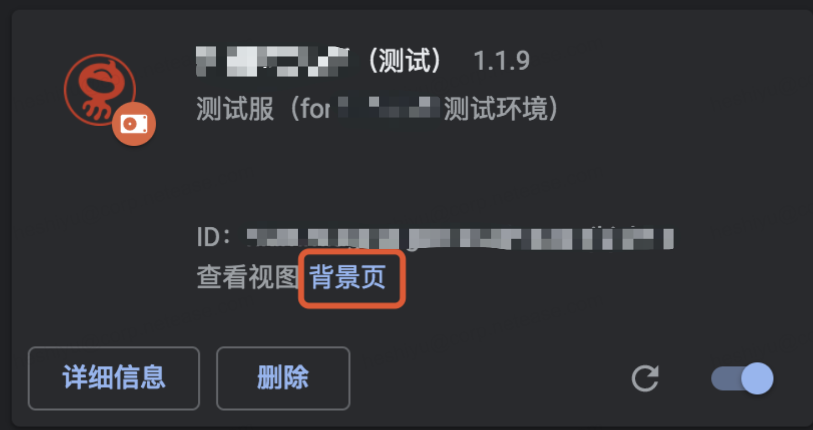
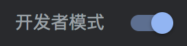
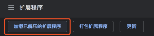

# Chrome Extension 实践笔记
[[toc]]
主要技术：vue(2.5.11) + wcer(1.0.2) + webpack(3.6.0) + axios

## 关于调试
> 位置：chrome://extensions/

找到插件后点击“背景页”，随后会弹出插件的开发者工具（类似F12），里面都是有关 background.js 的行为（如接口请求、tab监听等等），就可以进行调试了。

## 本地加载插件包
在发布前，也可以把 插件的dist文件 先加载到自己的谷歌浏览器进行测试。

> 位置：chrome://extensions/

 - 打开“开发者模式”
    - 

 - 点击“加载已解压的扩展程序”
    - 

 - 选择刚刚生成的dist文件夹（注意：不是压缩包），即可
 

注意：出现“错误”可以忽视，一般为ws或者cookie报错，不影响使用。

