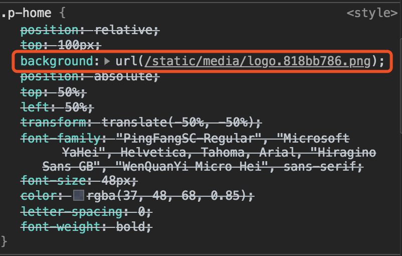

# webpack
> `webpack`是个模块打包机，它是通过`loader`对 `模块（Module）` 进行处理，通过`plugins`给webpack赋能，最后打包成浏览器能识别的js等文件。

[[toc]]

**原理：**
 - 识别“入口模块”
 - 分析模块依赖（`Tree Shaking`）
 - 解析模块（通过不同`Loader`）
 - 编译模块，生成抽象语法树`AST`
 - 循环遍历`AST`
 - 打包成`bundle.js`

## Module、Chunk、Bundle
首先，**webpack是个模块打包机**。

### Module
指“模块”。

我们编写的**任何文件**，对webpack来说都是一个个**模块**。

通过配置`module.rules`，指定哪些文件交给哪些`loader`去处理：
```js
module: {
    rules: [
        {
            test: /\.css$/,
            use: ['style-loader', 'css-loader']
        }
    ]
}
```

### Chunk
指“代码块”，一个 Chunk 由多个 `模块(Module)` 组成。用于代码合并与分割。

以 **入口文件（即入口模块）** 为例，webpack会通过 **入口模块和其它模块之间形成引用关系**，去逐个打包模块，那这些“有关联的`Module`”就形成了一个`Chunk`。
> webpack源码中对Chunk的解释：
> 
> A Chunk is a unit of encapsulation for Modules. 
>
> Chunks are "rendered" into bundles that get emitted when the build completes.

产生chunk的三种途径（详见 [代码分割](#代码分割)）：不同的入口模块（entry）、SplitChunksPlugin、动态导入

### Bundle
综上，`Chunk`是一些“有关联的模块（module）”的封装单元，并且它们会在 **构建之后** 变成一个个 `Bundle`。
> 大多数情况下，一个Chunk只会产生一个Bundle

#### bundle.js
`bundle.js`实际上是一个`立即执行的匿名函数`：
 - 这个函数接受一个数组
    - 它由一个个`模块（Module）` （模块**以`function`的形式**） 组成
    - `模块（Module）`按照`require`的顺序排列
 - 每个`模块（Module）`都有唯一的id（从0递增）

<!--  -->


[查看bundle.js](/bundle.js)


## Loader、Plugins
 - `Loader` 模块转换器。对模块进行**解析处理**；
 - `Plugins` 扩展插件。在 Webpack 构建流程中的特定时机注入扩展逻辑来改变构建结果。

### Loader
#### 常用的loader
sass-loader、less-loader、css-loader、style-loader、babel-loader、vue-loader、file-loader

:::tip
**file-loader**：在执行 `import MyImage from './my-image.png` 时，这张图片会经过处理、被添加到 `output` 指定的目录，然后 `MyImage` 变量将表示 **这张图片在处理后** 的最终url。

**url-loader**：和`file-loader`功能类似，处理图片、字体图标等文件。额外提供了`options.limit`，指定**转为base64的上限值**
 - 底层依赖于`file-loader`（不安装`file-loader`会报错）

**css-loader**：处理 `.css` 里的 url。`css`内的`url('./my-image.png')` 会被处理，然后添加到 `output` 指定的目录，然后`url()`里面会被替换成 **这张图片在处理后** 的最终url。（类似`file-loader`处理）

未经过**css-loader**处理：


经过**css-loader**处理：

:::

因为 url-loader底层依赖于file-loader，通常webpack里只需配置`url-loader`即可
```js
{
    test: /\.(png|jpg|jpeg|gif|eot|ttf|woff|woff2|svg|svgz)$/i,
    use: [
        {
            loader: require.resolve('url-loader'),
            options: {
                limit: 10000, // 小于10kb的图片会转成base64
                name: 'static/media/[name].[hash:8].[ext]'
            }
        },
        'image-webpack-loader' /*对图片进行压缩*/
    ]
},
```

### Plugins
#### 常用的plugins
 - html-webpack-plugin：用于生成一个HTML文件，并将webpack最终生成的JS、CSS以及一些静态资源以`script`、`link`的形式插入到其中。
 - happypack：把任务分解给多个子进程去并发执行。

#### 特点
1、`plugins`需要在`webpack.plugins`里实例化并注册；

2、webpack会在调用时，执行`plugin对象`的`apply`方法，传入 `compiler对象`；

3、`compiler下的hooks对象`挂载了相应的webpack事件钩子；

4、webpack会在 **整个构建过程中** 调用这些事件钩子。

> `compiler`对象里拥有 `所有和webpack主环境相关` 的信息。

:::tip
**常见的事件钩子：**

（按触发顺序）
 - **afterPlugins**
    - 初始化插件之后
 - **compile**
    - 在创建新的compilation之前
 - **afterCompile**
    - 创建完新的compilation
 - **emit**
    - 在 生成资源 之前
 - **afterEmit**
    - 在 生成资源 之后
 - **done**
    - 完成本次编译
:::

#### 示例插件：保存时clear日志
```js
class CleanTerminalPlugin {
    constructor(options = {}) {
        this.time = 0;
    }

    apply(compiler) {
        this.useCompilerHooks(compiler);
    }

    useCompilerHooks(compiler) {
        // 在创建完新的compilation后，清空控制台
        compiler.hooks.afterCompile.tap('CleanTerminalPlugin', () => this.clearConsole());
    }

    clearConsole() {
        if (this.time > 2) {
            console.clear();
        } else {
            this.time++;
        }
    }
}
```

## 代码分割
`代码分割`最初的目的是 **是把代码分离到不同的 bundle 中**。这样做的好处是可以 `按需加载` 或 `并行加载` 这些 bundle。
> 代码分割后，bundle 的体积会更小、控制加载优先级。如果使用合理，可以优化加载时间。

因为 **`Chunk`是对一些模块进行封装的基本单位** ，所以代码分割方式和“生成不同`Chunk`”是一样的：
 - 不同的入口模块（entry）
 - 防止重复
    - SplitChunksPlugin（需指定`output.chunkFilename`）
 - 动态导入

### 通过Entry划分
直接通过 **新增入口** 来生成不同 Chunk：

```js
// 假设`index.js`、`another.js`中都引入了`lodash`：
module.exports = {
    entry: {
        index: './src/index.js',
        another: './src/another.js', // 新增的入口
    },
    output: {
        filename: '[name].bundle.js', // 注意：多入口时，filename不能写死，要带上[name]
        path: path.resolve(__dirname, 'dist')
    }
}
```

`npm run build`效果：
```
            Asset     Size   Chunks             Chunk Names
another.bundle.js  550 KiB  another  [emitted]  another
  index.bundle.js  550 KiB    index  [emitted]  index
Entrypoint index = index.bundle.js
Entrypoint another = another.bundle.js
```

可见，**不同入口Chunk之间包含的一些重复模块，会被重复引入到各个Bundle中**。

需要进一步通过`防止重复`来移除重复模块。

### 通过SplitChunkPlugin
`SplitChunksPlugin`可以将 **不同入口Chunk之间包含的一些重复模块** 提取到一个新生成的 chunk

```js
// 假设`index.js`、`another.js`中都引入了`lodash`：
module.exports = {
    entry: {
        index: './src/index.js',
        another: './src/another.js',
    },
    output: {
        filename: '[name].bundle.js',
        path: path.resolve(__dirname, 'dist')
    },
    // 新增以下：（如不指定，webpack会默认只会对async的第三方包进行分割，见下方“默认配置”）
    optimization: {
        splitChunks: {
            chunks: 'all' // 默认async
        }
    }
}
```

`npm run build`效果：
```
                          Asset      Size                 Chunks             Chunk Names
              another.bundle.js  5.95 KiB                another  [emitted]  another
                index.bundle.js  5.89 KiB                  index  [emitted]  index
vendors~another~index.bundle.js   547 KiB  vendors~another~index  [emitted]  vendors~another~index
Entrypoint index = vendors~another~index.bundle.js index.bundle.js
Entrypoint another = vendors~another~index.bundle.js another.bundle.js
```
可见，**不同入口Chunk之间包含的一些重复模块** 已经被提取到了`vendors`这个Chunk里

`vendors~another~index`，表示：**缓存组~提取的Chunk1~提取的Chunk2...**
> 其中，vendors是默认配置下的vendors缓存组
> 
> 也可以通过声明`cacheGroups.vendors.name`来指定这个 提取好的chunk 名字

#### 默认配置
```js
optimization: {
    splitChunks: {
        // chunks：表示
        chunks: 'async', // <-- 默认只对“异步加载模块”进行分割
        // minSize：表示引入的包或模块>30kb才会加入“切割范畴”
        minSize: 30000,
        minChunks: 1,
        maxAsyncRequests: 5,
        maxInitialRequests: 3,
        automaticNameDelimiter: '~',
        name: true,
        cacheGroups: {
            // 默认有一个vendors缓存组
            vendors: {
                test: /[\\/]node_modules[\\/]/,
                priority: -10
            },
        default: {
                minChunks: 2,
                priority: -20,
                reuseExistingChunk: true
            }
        }
    }
}
```

#### mini-css-extract-plugin
通过`mini-css-extract-plugin`将CSS从主应用程序中分离。
```js
const MiniCssExtractPlugin = require('mini-css-extract-plugin');

// ...
module: {
    rule: [
        {
            test: /\.(css|less)$/,
            // 以下为简化代码
            use: [
                'style-loader',
                MiniCssExtractPlugin.loader, // <-- 使用
                'css-loader',
                'postcss-loader',
                'less-loader'
            ],
            sideEffects: true
        }
    ]
},
plugins: {
    new MiniCssExtractPlugin({
        filename: 'static/css/[name].[contenthash:8].css',
        chunkFilename: 'static/css/[name].[contenthash:8].chunk.css'
    })
},
optimization: {
    minimizer: [
        // mode: 'production'会开启tree-shaking和js代码压缩，但配置optimization. minimizer会使默认的压缩功能失效。
        // 所以，指定css压缩插件的同时，务必指定js的压缩插件。
        new TerserPlugin({}),
        // This is only used in production mode
        new OptimizeCSSAssetsPlugin({})
    ],
}
```

配合`optimization.minimizer`、`optimization.splitChunks.cacheGroup`使用：
 - optimization.minimizer：对css进行压缩（也需指定js压缩，因为会影响webpack对js的压缩）
 - optimization.splitChunks.cacheGroup：将可复用的css代码块提取到单独的 chunk 文件
    - 这一点不是必须，因为复用的css文件比较少，且对于“全局复用样式”可以通过`style-resources-loader`

### 通过动态导入
两种方式：1、`import()`；2、`require.ensure`（较少）

`import()`内部通过 `Promise` 来实现动态导入。

```js
module.exports = {
    entry: {
        index: './src/index.js' // 只有一个index入口
    },
    output: {
        filename: '[name].bundle.js',
        chunkFilename: 'static/js/[name].[chunkhash:8].chunk.js', // 指定chunk的名字生成规则
        path: path.resolve(__dirname, 'dist')
    }
}
```
是在`import()`时，进行 **魔术注释** 指定 `非入口chunk` 的名称
```js
import(/* webpackChunkName: "pc-home" */ '@/view/pc/home')
```
> 
> 此处实验过，入口chunk也会应用chunkFilename的规则？


`npm run build`效果：
```
                   Asset      Size          Chunks             Chunk Names
         index.bundle.js  7.88 KiB           index  [emitted]  index
vendors~lodash.bundle.js   547 KiB  vendors~lodash  [emitted]  vendors~lodash
Entrypoint index = index.bundle.js
```
`vendors~lodash`，是因为webpack默认会对async包进行`SplitChunk`配置下的`vendors`缓存组。

## 热编译的提速方案

### Happypack
在webpack里，loaders都是单个解析、编译，不能同时处理多个任务。利用Happypack可以让它交给多个子进程去并发执行。执行完后，子进程再将结果发送给主进程。

```js
// 共享进程池：多个Happypack实例都使用同一个共享进程池的子进程去处理任务，防止资源占用过多。
const Happypack = require('happypack');
const happyThreadPool = Happypack.ThreadPool({ size: 5 });

modules.exports = {
    plugins: [
        new HappyPack({
            id: 'babel',
            loaders: ['babel-loader'],
            threadPool: happyThreadPool
        })
    ]
}
```

### DllPlugin
将复用性较高的第三方模块，打包到动态链接库里。
> 很多产品都用到螺丝，但并不是每次生产产品都需要把生产螺丝的过程重新执行。而是螺丝单独生产，侧面也加快了产品的生产速度。

使用Dll，分为DLL构建、主项目构建。
 - 在DLL构建文件里指定要打包的第三方库、接入DllPlugin
    - 执行DLL构建打包后，会生成：`x.dll`、`x.manifest.json`
    - `x.dll`：类似bundle.js，用数组保存模块，索引值作为id
    - `x.manifest.json`：描述对应dll文件里的模块信息
 - 在主项目构建文件引入动态库文件
    - `webpack.DllReferencePlugin`
 - 在入口文件引入dll

和CDN区别：
 - CDN需要配置externals、业务层去掉import
 - DLL放在本地，比较稳定、业务层引用不变

### HardSourceWebpackPlugin
`高速缓存`会 **在第二次启动** 及以后，直接从缓存获取文件，以提高开发编译速度。
> 搭配Happypack、DLL、CDM使用更佳

```js
// webpack.dev.js
    new HardSourceWebpackPlugin({
        // 缓存存放位置
        cacheDirectory: 'node_modules/.cache/hard-source/[confighash]',
        // hash生成规则
        configHash: function(webpackConfig) {
            return require('node-object-hash')({ sort: false }).hash(webpackConfig);
        },
        // Either false, a string, an object, or a project hashing function.
        environmentHash: {
            root: process.cwd(),
            directories: [],
            files: ['package-lock.json', 'yarn.lock']
        },
        // 控制台输出格式
        info: {
            mode: 'test',
            level: 'debug' // 'debug', 'log', 'info', 'warn', or 'error'
        },
        // 旧缓存清空机制
        cachePrune: {
            // 缓存有效期大于2days时
            maxAge: 2 * 24 * 60 * 60 * 1000,
            // 所有缓存体积大于500MB时
            sizeThreshold: 500 * 1024 * 1024
        }
    })
```

### 总结
建议：在 **开发**、**打包** 不同环境采用不同策略，以尽最大优化：

| 方式 | DLL | CDN | webpack打包 | 高速缓存 |
| --- | --- | --- | --- | --- |
| 开发 | react、react-router-dom、react-dom | lodash、moment | **antd** | ✔ |
| 打包 | react、react-router-dom、react-dom、**antd** | lodash、moment | / | ✘ | 

**Q：为什么 antd 在开发时放DLL、打包时放webpack？**
 - 开发时，通过DLL会完整构建，提高编译速度
 - 打包时，可以tree shaking，减少打包体积

**Q：具体放置策略？**
 - 全盘使用的包放入DLL（如：react）；
 - 部分使用的包通过webpack打包（如：antd）；
 - 体积较小通过CDN（如：lodash）


## gulp与webpack的区别
`gulp`强调的是**前端开发流程**。

**用法：** 定义一系列的task，再定义它处理的事物、顺序，最后让gulp执行task，从而构建前端项目。

4个常用的方法：
 - **src（）**：获取流
 - **dest（）**：写文件
 - **task（）**：定义任务
 - **watch（）**：用来监听事件

 IE8下最好用`gulp`，IE9用`webpack`

## 实践笔记
[webpack使用笔记](./DEMO.md)

## 链接
 - [webpack的配置模式mode](https://www.webpackjs.com/concepts/mode/)

 - [理解webpack之process.env.NODE_ENV详解(十八)](https://www.cnblogs.com/tugenhua0707/p/9780621.html)

 - [Webpack 理解 Chunk](https://juejin.im/post/5d2b300de51d45775b419c76#heading-2)
