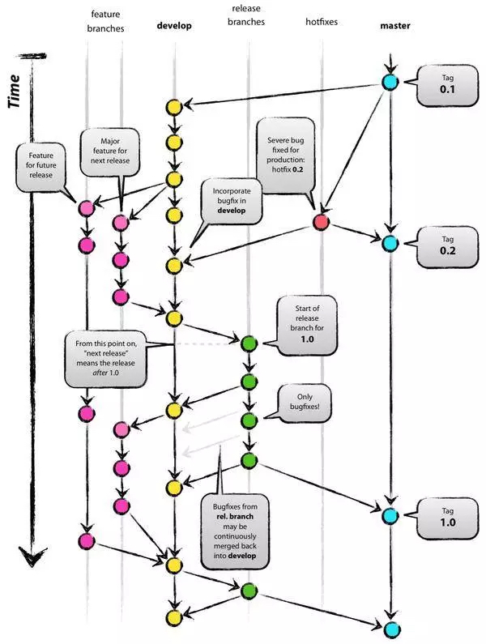

# Git规范

[[toc]]

## Git分支命名
 - **master：主分支**
    - 负责记录线上版本的迭代

 - **develop：开发分支**
    - 负责目前最新开发进度的版本

 - **feature/\*：功能分支（*“\*”代表的是功能的简称*）**
    - 用于开发新的功能
    - 基于`develop分支`检出
    - 局部开发完成并自测通过后，需要合并到`develop分支`，随后删除

 - **release：提测分支**
    - 用于代码上线准备，创建后由QA部署到测试环境进行测试
    - 基于`develop分支`检出
    - 提测过程中，发现bug，则在`release分支`进行修复；
    - 上线前，需将`release分支`合并到`master`、`develop分支`

 - **hotfix：紧急修复分支**
    - 用于线上bug的修复
    - 基于`master分支`检出
    - 修复完后，合并到`master`、`develop分支`

 - **refactor：代码优化分支**
    - 用于代码的优化（一般在提测之后），优化在开发阶段产生的冗余或不完善的代码
    - 基于`release分支`检出
    - 优化完后，合并到`release分支`

## Git分支的Commit格式
格式：`type: message`

### type（提交类型）
 - feature: 新特性
 - refactor: 代码重构 && 优化
 - style: 样式修改
 - fix: bug修复（提测阶段 && 紧急线上）
 - docs: 文档修改（文案修改 && 文件更新）

### message（提交描述）
对应内容是commit简短描述：大致修改内容、影响文件/范围、进度等。
 > 英文中文皆可，一般不超过50个字符

### 部分统一描述
 - 文件打包：`npm run build`
 - 代码格式化：`npm run format`

### Git分支图


## Commit校验工具——husky
原理：在`git commit`提交代码前，利用Git钩子（`pre-commit`、`commit-msg`）来实现代码规范检测、提交信息检测。

### 安装husky & lint-staged
    yarn add husky lint-staged -D

`lint-staged`可以仅仅过滤出Git代码暂存区中**符合的文件**（即本次被committed的文件）。
> 虽然如Eslint之类的也有文件过滤配置，但毕竟还是对于匹配文件的全量遍历，如全量的.js文件，基本达不到性能要求，有时还会误格式化其他同学的代码，因此我们引入Lint-staged。

### 在新建脚本`verify-commit-msg.js`
```js
const chalk = require('chalk');

const msgPath = process.env.HUSKY_GIT_PARAMS;
const msg = require('fs').readFileSync(msgPath, 'utf-8').trim();

const commitRE = /^(((feature|fix|docs|style|refactor|jira)?: .{1,50})|npm run format|merge|build)/;

if (!commitRE.test(msg)) {
    console.log();
    console.error(
        `  ${chalk.bgRed.white(' ERROR ')} ${chalk.red(`commit信息格式不正确，请遵循“前端Git规范”`)}\n\n` +
            chalk.red(`  Examples: <type>: <message>\n\n`) +
            `    ${chalk.green(`feature: add component Header`)}\n` +
            `    ${chalk.green(`（以及：${chalk.cyan(`npm run format`)}、${chalk.cyan(`merge`)}、${chalk.cyan(`build`)}）`)}\n\n`
    );
    process.exit(1);
}
```
这样就可以自由定制信息。
> 也可以用已有的包[commitlint](https://github.com/conventional-changelog/commitlint)进行校验。

### package.json配置
```json
"scripts": {
    "format": "prettier --write \"./src/**/*.{js,jsx,json}\"",
    "lint": "eslint --fix --ext .js,.jsx src"
},

"gitHooks": {
    "pre-commit": "lint-staged",
    "commit-msg": "node scripts/verify-commit-msg.ts"
},
"lint-staged": {
    "packages/**/*.{js,jsx,ts,tsx}": [
      "npm run format",
      "npm run lint",
      "git add ."
    ]
},
```
此处`lint-staged`的用处：对本次被committed的所有`packages`下的所有子孙目录的`js、jsx、ts、tsx`文件，执行`npm run format`、`npm run lint`、`git add .`命令。

其中，
 - `pre-commit`此阶段可指定某些操作（如：代码检查）
> 执行时机：输入`git commit -m "xxx"`后、`commit-msg`前

 - `commit-msg`此阶段可以“检查commit提交信息”
> 执行时机：commit生效前


以上配置后，如果代码检测不通过，或者不符合`<type>: <subject>`规则，Git 将放弃此次提交。

### 使用注意
 1、由于使用了`git add .`，会将`待定区`文件全部提交 *（尽量保证每次的“小功能提交”）*；

 2、即使被husky退回提交，也会代码格式化、语法检查/修正；

 3、ESLint的`warning`不会被Husky拦截 *（ESLint rules尽量配置成error）*；

 4、跳过检测，强制提交（不推荐）

    git add . && git commit --no-verify -m "force commit"

## 参考链接
 - [前端代码风格自动化系列（三）之Lint-staged](https://segmentfault.com/a/1190000017790711?utm_source=tag-newest)
 - [git commit 规范](https://www.jianshu.com/p/856bbb5ed9ec)