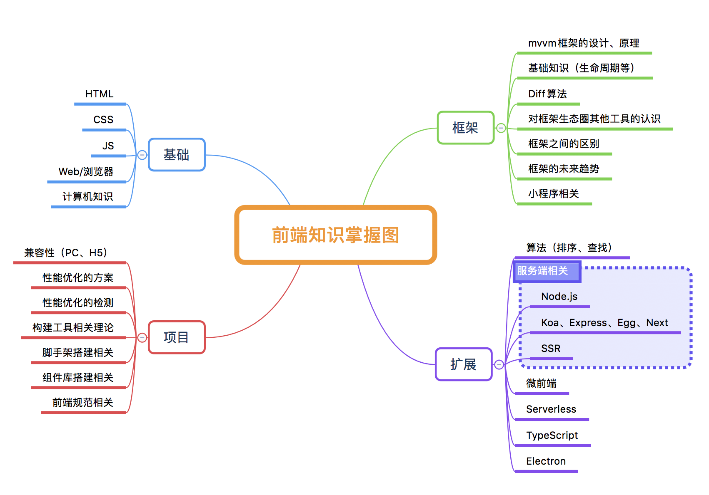

::: tip -------------------------------最近更新-------------------------------
#### 2020-05-10
 - [webpack4知识整理](/skill/project/webpack/)
<Badge text="笔记" type="error"/>

#### 2020-04-18
 - [Web性能优化](/skill/web/optimize/)
<Badge text="基础" type="success"/>

#### 2020-04-17
 - [Diff、React Diff、Vue Diff](/skill/web/diff/)
<Badge text="基础" type="success"/>

#### 2020-04-01
 - [浏览器缓存机制](/skill/web/browser-cache/)
<Badge text="基础" type="success"/>

#### 2020-03-23
 - [Complete intro react](/skill/note/complete-intro-react/)
<Badge text="笔记" type="error"/>

#### 2020-01-03
 - [React Fiber](/skill/react/fiber/)
<Badge text="框架" type="warning"/>
:::

#### 前端知识掌握图（2020-05-04）

<!-- 
<Badge text="基础" type="success"/>
<Badge text="框架" type="warning"/>
<Badge text="笔记" type="error"/>
<Badge text="前端周边" type="normal"/>
 -->

## HTTP <Badge text="基础" type="success"/>
### WebWorker
[查看](/skill/html/web-worker/)
### 其他
[查看](/skill/html/other/)

## CSS <Badge text="基础" type="success"/>
### CSS布局
[查看](/skill/css/layout/)
### BFC和浮动
[查看](/skill/css/bfc/)
### 弹性盒模型（FlexBox）
[查看](/skill/css/flex-box/)
### Sass和Less的作用、区别
[查看](/skill/css/sass-less/)
### 其他
[查看](/skill/css/other/)

## JS <Badge text="基础" type="success"/>
### JS异步解决方案的发展历程
[查看](/skill/js/async-plan/)

### JS设计模式
[查看](/skill/js/design-patterns/)

### 常用的DOM操作方法
[查看](/skill/js/dom/)

### 事件循环（EventLoop）
[查看](/skill/js/event-loop/)

### CommonJS、ES6模块规范
[查看](/skill/js/modular/)

### JS正则表达式
[查看](/skill/js/regex/)

### Class（类）
[查看](/skill/js/class/)

### Typescript基本知识
[查看](/skill/js/typescript/)

### 其他
[查看](/skill/js/other)

## NodeJS <Badge text="基础" type="success"/>
### NodeJS中的多进程、集群
[查看](/skill/nodejs/multi-process/)
### koa2
[查看](/skill/nodejs/koa/)
### 其他
[查看](/skill/nodejs/other)

## Web/浏览器 <Badge text="基础" type="success"/>
### Diff、React Diff、Vue Diff
[查看](/skill/web/diff/)
### 浏览器
[查看](/skill/web/browser/)
### 浏览器缓存机制
[查看](/skill/web/browser-cache/)
### CDN
[查看](/skill/web/cdn/)
### 跨域资源共享（CORS）
[查看](/skill/web/cors/)
### HTTP
[查看](/skill/web/http/)
### Web性能优化
[查看](/skill/web/optimize/)
### 浏览器/服务端渲染
[查看](/skill/web/ssr/)
### XSS、CSRF、SQL注入
[查看](/skill/web/web-attack/)
### WebStorage
[查看](/skill/web/web-storage/)
### WebSocket
[查看](/skill/web/websocket/)
### 其他
[查看](/skill/web/other)

## React <Badge text="框架" type="warning"/>
### React基础知识
[查看](/skill/react/basic/)
### React16基础知识
[查看](/skill/react/feature-v16/)
### React Fiber
[查看](/skill/react/fiber/)
### 生命周期
[查看](/skill/react/life-cycle/)
### setState
[查看](/skill/react/set-state/)
### Hooks
[查看](/skill/react/hooks/)
### 踩坑记录
[查看](/skill/react/question)

## Vue <Badge text="框架" type="warning"/>
### Vue基础知识
[查看](/skill/vue/basic/)
### 生命周期
[查看](/skill/vue/life-cycle/)
### Vue3.0新特性
[查看](/skill/vue/feature-v3//)
### [开发笔记] Vue使用问题集合
[查看](/skill/vue/question/)
### [开发笔记] KeepAlive
[查看](/skill/vue/keep-alive/)
### [vue源码] 基本知识
[查看](/skill/vue/build/)
### [vue源码] 数据驱动（Data Driven）
[查看](/skill/vue/data-driven/)
### [vue源码] 组件化（Component）
[查看](/skill/vue/vue-router/)
### [工具] Vue Router实现思路
[查看](/skill/vue/vue-router/)
### [组件库] 组件开发思路
[查看](/skill/vue/component-lib/)

## 项目笔记 <Badge text="笔记" type="error"/>
<!-- ### SourceMap
[查看](/skill/project/source-map/) -->
### [工具] webpack
[查看](/skill/project/webpack/)
### [工具] Babel7
[查看](/skill/project/babel/)
### [工具] 其它工具
[查看](/skill/project/tools/)
### [开发笔记] Chrome插件
[查看](/skill/project/chrome-extension/)
### [踩坑记录] vue-cli + Prettier
[查看](/skill/project/prettier-vue-cli/)
### [踩坑记录] PC兼容性方案
[查看](/skill/project/compatibility/pc/)
### [踩坑记录] H5兼容性方案
[查看](/skill/project/compatibility/h5/)
### 项目笔记
[查看](/skill/project/notes/)
### 其他
[查看](/skill/project/other)

## 读书/参会心得 <Badge text="笔记" type="error"/>
### D2-2019
[查看](/skill/note/d2-2019)
### vue-conf-2018
[查看](/skill/note/vue-conf-2018)
### Vue Composition API RFC
[查看](/skill/note/vue-composition-api-rfc/)
### Complete intro react
[查看](/skill/note/complete-intro-react/)
### 《Webpack实战》 - 居玉浩
[查看](/skill/note/webpack-experience/)
### 《深入React技术栈》 - 陈屹
[查看](/skill/note/react-deep-learning/)
### 优秀文章链接
[查看](/skill/note/links)

## 计算机 <Badge text="前端周边" type="normal"/>
### 单处理器进程的调度策略
[查看](/skill/computeracy/scheduling-strategy/)

## 算法 <Badge text="前端周边" type="normal"/>
### 八大排序
[查看](/skill/algorithm/sort/)
### 二分查找
[查看](/skill/algorithm/search/)
### 动态规划
[查看](/skill/algorithm/dp/)
### 时间复杂度
[查看](/skill/algorithm/time-complexity/)