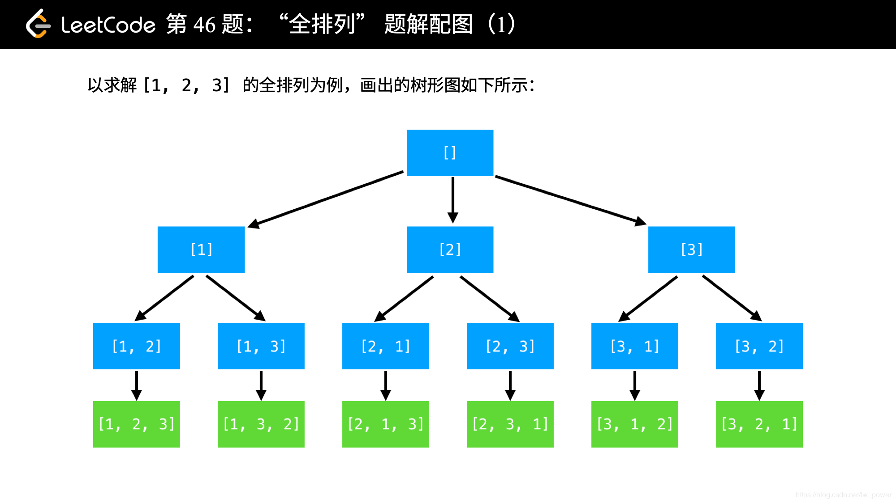

# 基本思想

[[toc]]

## 分治法
将问题划分为一个个独立的子问题，利用 **递归** 去解子问题，最后将子问题的解合并得到原问题的解。

### 示例
快速排序：
```js
const quickSort = arr => arr.length <=1 ? arr :
    quickSort(arr.filter(x => x < arr[0]))
    .concat(arr.filter(x => x === arr[0]))
    .concat(quickSort(arr.filter(x => x > arr[0])))
```
每次步骤类似：

1、找一个基准值

2、< 基准值，放左边；否则放右边。并将左、中、右合并（但合并的这步通常还执行不了）

3、分别对左、右两边再重复1、2步，直到子数组长度为1为止，开始逐渐合并。

## 动态规划
和 **分治法** 基本思想相同，不同的是**子问题往往并不独立**。而是**将子问题的解记录在表格中**，后续解决较大问题时如果需要可以查询，避免重复计算。

思路：

1、找出最优解的性质；

2、递归定义最优值，定义状态数组dp[i]

3、自底向上的方式，算出最优值

### 示例
最大子序和：

给定一个整数数组nums，找出一个具有最大和的连续子数组（最少包含一个元素），返回其最大和。

:::tip
示例:

输入: [-2, 1, -3, 4, -1, 2, 1, -5, 4]

输出: 6

解释: 连续子数组 [4, -1, 2, 1] 的和最大，为 6
:::

```js
/*
 * dp[i]表示：以下标 i 为子序列末端时的最大子序和
 * dp[0] = nums[0]
 * dp[i] = max{ dp[i-1] + nums[i], nums[i] }
 */ 

function maxSubArray (nums) {
    if (!nums.length) return;

    let sum = nums[0]; // 表示以“当前位置的数值”为子序列末端时的最大子序和
    let ans = nums[0]; // 表示整个数组中的最大子序和

    for (let i = 1; i < nums.length; i++) {
        sum = Math.max(sum + nums[i], nums[i]);
        ans = Math.max(sum, ans);
    }

    return ans;
}
```

## 贪心算法
贪心算法的思想是：**在满足条件下，每次都选择对自己最有利的才可以获取最优解。**

### 示例
买卖股票的最佳时机 II：

:::tip
给定一个数组，它的第 i 个元素是一支给定股票第 i 天的价格。

设计一个算法来计算你所能获取的最大利润。你可以尽可能地完成更多的交易（多次买卖一支股票）。
:::

```js
var maxProit = function(prices) {
    let profit = 0;
    let len = prices.length;

    for (let i = 1; i < len; i++) {
        if (prices[i] > price[i - 1]) {
            profit += prices[i] - prices[i - 1];
        }
    }

    return profit;
}
```

## 回溯法
通过**深度优先遍历，系统地搜索一个问题的所有解或任一解**。
> 深度优先遍历：完成一件事情有多个阶段，每个阶段有多种选择，先走其中一种，实在走不下去，再回退到上个节点继续下一个选择。

回溯时，必须保证回到之前刚来到这个节点的状态，叫做“状态重置”。
> 在搜索过程中，可以利用剪枝函数避免无效搜索。

### 示例
全排列：
:::tip
给定一个 没有重复 数字的序列，返回其所有可能的全排列：

输入: [1,2,3]

输出:
[
  [1,2,3],
  [1,3,2],
  [2,1,3],
  [2,3,1],
  [3,1,2],
  [3,2,1]
]
:::



```js
function backtrack (list, tempList, nums) {
    if (tempList.length === nums.length) return list.push([...tempList]);

    for (let i = 0; i < nums.length; i++) {
        if (tempList.includes(nums[i])) continue;

        tempList.push(nums[i]);
        backtrack(list, tempList, nums);
        tempList.pop();
    }
}

var permute = function (nums) {
    let list = [];
    backtrack(list, [], nums);

    return list;
}
```

<!--  -->

## 参考链接
 - [基本算法思想：递归+分治+动态规划+贪心+回溯](https://segmentfault.com/a/1190000014680336)
 - [「回溯算法」专题 2：从「全排列」问题开始认识「回溯算法」](https://liweiwei1419.gitee.io/leetcode-algo/2018/02/02/leetcode-solution/backtracking-2/)