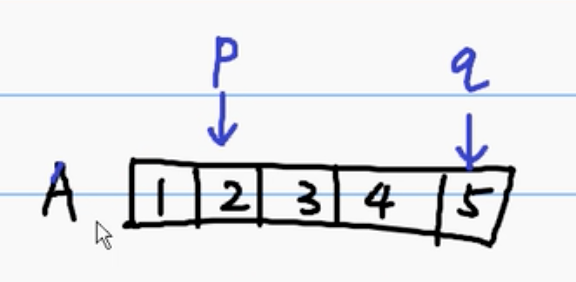

# 46-permutations（全排列）

给定一个 没有重复 数字的序列，返回其所有可能的全排列。

**示例**：
```js
输入: [1,2,3]
输出:
[
  [1,2,3],
  [1,3,2],
  [2,1,3],
  [2,3,1],
  [3,1,2],
  [3,2,1]
]
```

## 思路
通过 **递归 + 回溯** 实现。
 - 通过for循环来选出“当前数组”中的“领头”
    - 方式是将当前下标，与“当前数组”的“领头”进行swap交换；（当前数组的每个元素都会和“领头”交换）

 - 每一次“领头”更新后，紧接着就**利用递归**，再对其“子数组”选出“子数组”中的“领头”；那对于“子数组”，也是同样的情况，继续递归，继续选“领头”，以此类推
    - 

 - 直到“子数组”的只剩1个长度时，将这条分支下的arr推入result

 - 当某条分支记录完排列后，需要还原nums，将上一步的swap交换回来

 - 等到所有分支都执行完，会回溯到**最顶部的for循环**（也就是p、q长度为原数组这一层，“领头”为原数组最后一个元素时，发现nums最后回来了）

## 代码
```js
/**
 * @param {number[]} nums
 * @return {number[][]}
 */
var permute = function(nums) {
    let result = [];
    let len = nums.length;

    function _permute (arr, p, q) {
        if (p === q) {
            result.push(arr.slice());
        } else {
            for (let i = p; i <= q; i++) {
                swap(arr, i, p);
                _permute(arr, p + 1, q);
                swap(arr, i, p);
            }
        }
    }

    _permute(nums, 0, len - 1);

    return result;
};

function swap(arr, i, j) {
    [arr[i], arr[j]] = [arr[j], arr[i]];
}
```


## 参考链接
 - [46. 全排列](https://leetcode-cn.com/problems/permutations/)
 - [[算法教程] 全排列](https://www.bilibili.com/video/av9830088?from=search&seid=5967589139650667616)