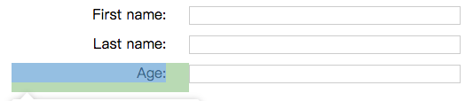
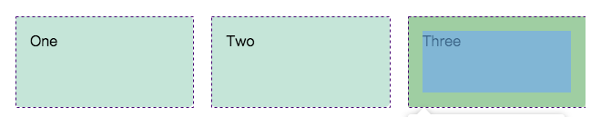

# CSS布局

[[toc]]

## 常见布局方案
前端布局的发展历程：

[表格布局](#表格布局) > [定位布局](#定位布局) > [浮动布局](./../bfc/) > [Flex布局](./../flex-box/) > [网格布局](#网格布局)

> 还有一种 多列布局 比较少用。


### 表格布局
> `<table>`默认设置了一组table布局属性。当这些属性被应用于`非<table>`元素时，就是表格布局。
> 
> 常用于兼容一些不支持 Flex、Grid 的浏览器。

 - `display: table`：指定为表格容器（类比于`<table>`）
 - `display: table-row`：指定为表行（类比于`<tr>`）
 - `display: table-cell`：指定为单元格（类比于`<td>、<th>`）



### 定位布局
脱离标准流，但**不会影响** 标准流的排列。

 - 默认定位
    - position: static（默认位置）
 - 绝对定位
    - position: absolute（相对最近一个非static的父元素）
 - 固定定位
    - position: fixed（相对浏览器视窗的左上角）
 - 相对定位
    - position: relative（相对本身所在位置，原位置遵循标准文档流）
 - [粘性定位](../other/#粘性定位（sticky）)
    - position: sticky（先保持`position: static`，达到阈值时变成`postion: fixed`）
    - 该定位遵循`标准文档流`，**仍然保留**元素原本在文档流中的位置

### 浮动布局
[浮动布局](./../bfc/)
脱离标准流，**会影响** 标准流的排列。

### 网格布局
从 **行、列** 上定义元素的排列。（兼容性：需IE10 `及以上`）

 - `display: grid`：将父元素设为**网格容器**。

 - `grid-template-columns`：定义列轨道
 
 - `grid-template-rows`：定义行轨道

 - `grid-gap`：定义行列之间的间隙

```css
.container {
    display: grid;
    grid-template-colums: 200px auto 200px; /* 定义分别为 200px、自适应、200px的3列 */
    grid-template-rows: 100px 200px; /* 定义分别为 100px、200px高度的行 */
    grid-gap: 20px; /* 定义行、列之间间隙为20px */
}
```



### 多列布局（少见）
把内容`按列排序`（类似报纸）。

 - `colum-width`，指定 `按照至少某个宽度用尽可能多的列` 来填充
    - 类似`column-count`。高度浏览器列的数量


### [扩展] 三列布局的实现
要求：三个元素：左、中、右，其中左、右固定宽度为200px，中间宽度自适应。（元素高度100px）

```html
<div class="container">
    <div class="left"></div>
    <div class="center"></div>
    <div class="right"></div>
</div>
```

以下为 **5种** 实现方式：

#### 表格布局
```css
.container {
    display: table;
    width: 100%; /* 注意，这里因为是table，所以width是100% */
    height: 100px;
}

.left,
.center,
.right {
    display: table-cell;
}

.left,
.right {
    width: 200px;
}
```

#### 定位方式
```css
.container {
    position: relative;
    height: 100px;
}

.left,
.right {
    position: absolute;
    width: 200px;
    height: 100%;
}

.left {
    left: 0;
}

.right {
    right: 0;
}

.center {
    position: absolute;
    left: 200px;
    right: 200px;
    height: 100%;
}
```

#### 浮动方式
```css
/* 
 * 注：因为浮动元素的前一个元素若为非浮动，则会紧贴底部
 * 所以这种方式需更换DOM的排列顺序：left、right、cente
 */
.left,
.right {
    width: 200px;
    height: 100px;
}
.left {
    float: left;
}
.right {
    float: right;
}
.center {
    height: 100px;
    margin: 0 200px;
}
```

#### Flex布局
```css
.container {
    display: flex;
    height: 100px;
}

.left,
.right {
    width: 200px;
}

.center {
    flex: 1;
}
```

#### 网格布局
```css
.container {
    display: grid;
    grid-template-columns: 200px auto 200px;
    grid-template-rows: 100px;
}
```

## 移动端响应式布局方案
### 媒体查询
```css
@media media-type and (media-feature-rule) {
    /* CSS rules */
}
```
其中
 - media-type（媒体类型）：指定媒体类型（屏幕screen、打印稿print）
 - media-feature-rule：查询规则

### 百分比
也叫**流式布局**。

 - `width`: 相对于父容器width内容宽的百分比；
 - `height`: 相对于父容器height内容宽的百分比
 - `padding、margin`: 相对于父容器width内容宽的百分比（任意方向）
 - `border`: 不能使用百分比

### rem
`rem`是相对于`html`的字体大小

默认：1rem = 16px

#### 动态计算rem
通过头部内嵌一段脚本，监听设备宽度的变化来动态改变根字体大小。

1、先通过`viewport tag`来设置视窗大小为内容大小，同时禁止缩放（否则按照默认预设值）。
```html
<meta name="viewport" content="width=device-width,initial-scale=1,maximum-scale=1,minimum-scale=1;">
```


2、嵌入JS脚本。
```js
// 一般为了方便计算，会设置成：1rem = 100px。
(function() {
    function _setRootSize() {
        // a、获取根元素
        let rootHTML = document.documentElement;
        // b、获取当前设备宽度deviceWidth
        let deviceWidth = rootHTML.getBoundingClientRect().width || rootHTML.clientWidth;
        // c、设置当前设备宽度最大值为750px（750px为视觉稿宽度）
        // 因为deviceWidth > 750，物理分辨率大于 1500（devicePixelRatio = 2时），正常应该是PC访问
        deviceWidth = deviceWidth > 750 ? 750 : deviceWidth;
        // d、计算比率。（假设750px设计图也是一个设备，希望1rem = 100px，则需在其根节点字体大小设置100px，得出比率）
        let ratio = 750 / 100;
        // e、当前设备宽度 / 比率，算出当前设备的根节点字体大小
        let rootFontSize = deviceWidth / ratio;
        // f、设置根节点字体大小
        rootHTML.style.fontSize = rootFontSize + 'px';
    }
    _setRootSize();
    if (document.body) {
        _setRootSize();
    } else if (document) {
        document.addEventListener('DOMContentLoaded', _setRootSize);
    }
    window.addEventListener('resize', _setRootSize)
})();
```

### vw/vh
`vw`、`vh`都是视口单位，分别等于视口宽度、高度的百分比。
> 兼容性：ios8、android 4.4以上

### 几种响应式方案的区别
**媒体查询：** 
 - 缺点：1、定义多套查询规则；2、响应断点，体验性较差

**百分比：**
 - 缺点：1、不同属性的参考基准不一；2、并非所有属性都支持百分比

**rem：**
 - 优点：1、是个全局性的基准单位；2、动态计算，可限定最大宽度
 - 缺点：1、innerWidth/innerHeight可能不准确；2、安卓4.4以下不支持viewport缩放

**vw：**
 - 好处：1、全局性的基准单位；2、无需借助JS
 - 缺点：无法限定最大宽度

 可以根据实际情况采取合适的方案，也可采用多套配合（如网易新163就是：**媒体查询 + rem + vw**）

但以上都 **无法解决1px问题**。

## 参考链接
 - [从网易与淘宝的font-size思考前端设计稿与工作流](https://www.cnblogs.com/lyzg/p/4877277.html)
 - [Responsive Web Design 基礎 : <meta name=”viewport” > 設定](https://medium.com/frochu/html-meta-viewport-setting-69fbb06ed3d8)
 - [前端基础知识概述 -- 移动端开发的屏幕、图像、字体与布局的兼容适配](https://www.lagou.com/lgeduarticle/40493.html)
 - [响应式布局的常用解决方案](https://www.boeyc.com/index.php/archives/11/)