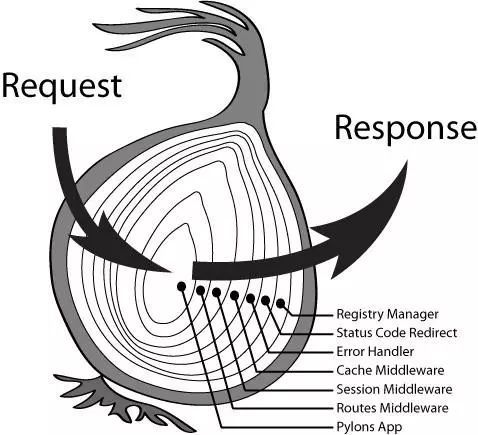

# koa2
> koa2由Express原班人马打造，是基于Node.js的web开发框架。

## 什么是koa2
koa2的特点是 **轻量、扩展性强** （将Express的router、view都移除了）

> Node.js的api支持的都是 **callback形式** 的异步编程模型。（callback嵌套问题）

## 与Node.js对比
例如：开启一个 http服务

```js
// Node.js
const http = require('http');

http.createServer((req, res) => {
    res.writeHead(200);
    res.end('hi koala');
}).listen(3000);
```

```js
// koa2
const Koa = require('koa');
const app = new Koa();
const {createReadStream} = require('fs');

app.use(async (ctx, next) => {
    if (ctx.path === '/favicon.ico') {
        ctx.body = createReadStream('./avicon.ico');
    } else {
        await next();
    }
});

app.use(ctx => {
    ctx.body = 'hi koala';
})
app.listen(3000);
```
由上面代码可知，koa2在 **模块化方面** 会更方便。


## koa2的优点
 - 中间件机制，采用`洋葱模型`
 - 模块化
 - `context`封装
 - 错误处理

## koa中间件
我个人理解的koa中间件，也算是一个函数，或者说是一个模块。它有别于其他函数的是，它能够在遇到next执行时，会去执行下一个中间件。

直到最后一个中间件执行完后，会再次回到上一个中间件在next后未执行的代码。从而实现一个类似洋葱模型的 **“从皮到心，从心到皮”**。它底层是通过 **compose** 来管理这些中间件执行顺序的。



## 参考链接
[读 koa2 源码后的一些思考与实践](https://cloud.tencent.com/developer/article/1552630)

