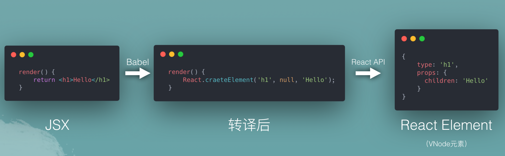

# Complete intro react

## JSX的自定义组件需首字母大写，否则会识别成HTML标签
The first letter being a capital one is actually a requirement since we will be dealing with be dedaling with a mix of HTML elements and React elements.

A JSX compiler(like Babel) will consider all names that start with a lowercase letter as names of HTML elements. This is important because HTML elements are passed as strings to `React.createElement` calls while React elements need to be passed as variables:

```jsx
<button></button>
// is equal to
React.createElement('button', null)

<Button></Button>
// is equal to
React.createElement('Button', null)
```

## JSX不是HTML
JSX is not understood by browsers. What browsers understand (given the React library is included) is the `React.createElement` API calls.

### Example1:
```jsx
function Button(props) {
    return <button type="submt">{props.label}</button>
}

ReactDOM.render(<Button label="Save" />, mountNode);
```

It will be translated to below one by Babel:

```js
function Button(props) {
    return React.createElement(
        'button',
        { type: 'submit' },
        props.label
    )
}

ReactDOM.render(
    React.createElement(Button, { label: 'Save' }),
    mountNode
)
```

### Example2:
```jsx
<ul>
    {todos.map(item =>
        <li>{item.content}</li>
    )}
</ul>
// will be translated to below one by Babel:
React.createElement(
    'ul',
    null,
    todos.map(item =>
        React.createElement('li', null, item.content)
    )
)
```
React takes this tree of objects and transforms it into a tree of DOM elements. From our point of view, we're done with this tree. We don't manage any actions on it. We just manage actions in the `todos` array itself.




## 每当调用`<Button>`时，React会做什么事情？
Every time we use the `Button` class-based component (by rendering a `<Button />`), React will instantiate an object from this class-based component and use that object's representation to create a DOM element

> React会实例化一个 这个基于class的组件 的对象，然后使用对象的形式去创建一个DOM节点

## Class-based组件的render方法不接受任何参数
Unlike function components, the `render` function in class-based components does not receive any arguments.

## Components vs Elements
React learner needs to understand the important distinctions between `Components` and `Element`:
 - A React Component is a template. A blueprint. A global definition. This can be either a function or a class (with a render method).

 - A React Element is what gets returned from components. It's an object that virtually describes the DOM nodes that a component represents. With a function component, this element is the object that the function returns and with a class component the element is the object that component's render method returns. React elements are not what you see in the browser. They are just objects in memory and you can't change anything about them.

 React internally creates, updates, and destroys objects to figure out the DOM elements tree that needs to be rendered to the browser. When working with class components, it's common to refer to their browser-rendered DOM elements as component instance. You can render many instances of the same component. The instance is the `this` keyword that you use inside class-based components. You would not need to create an instance from a class manually. You just need to remember that it's there somewhere in React's memory. For function components, React just uses the invocation of the function to determine what DOM element to render.

 > React Component是一种模板，一个蓝图，一个全局的定义。它是一个function或是一个class（带有render方法）

 > React Element是从React Component返回的。它是一个描述DOM节点的对象。对于函数式组件，element是函数式组件返回的对象；对于class组件，element是class组件返回的对象。React Element是你在浏览器中看不见的，他们只是存在内存中。同时，你也不能改变它们。

 > React可以通过在内部新增、修改以及删除对象，来判断出`需要被渲染到浏览器的DOM树`。当使用class组件时，它通常指的是作为组件实例的DOM元素（？）。你可以用同一个component来渲染多个实例。这个实例就是你在class组件里用到的`this`所指的对象。你不需要手动地创建一个实例，你只需记得它存在React内存中。对于函数式组件，React通过函数对的调用来确定要渲染的DOM节点。

## 纯函数（pure functions）的概念
In functional programing, we have the concept of pure functons. These are basically protected against any outside state; if we give them the same input, we'll always get the same output.

> 在函数式编程里，有个概念叫“纯函数”。它们不会受外部state的影响。如果我们给它们同样的输入，那我们就会获得相同的输出。

If a React component does not depend on (or modify) anythin outside of its definition (for example, if it does not use a global variable) we can label that component pure as well. Pure components have a better chance at being reused without any problems.

> 如果一个React组件不依赖（或修改）在它定义以外的任何内容（比如，如果他不使用全局变量），我们也可以将该组件标记为纯组件。纯组件有个好处就是被复用但不会出现其他问题。

## 变量 与 状态的关系
Every time you define a variable in you code you will beintroducing a state and every time you change the value of that variable you are mutating that state. Kepp that in mind.

> 每当你在代码里定义了一个变量，就相当于引入了一个状态；每当你个改变这个变量的值，就相当于你改变了这个状态。常记于心。

```js
const Button = () => {
  let count = 0;

  return (
    <button>{count}</button>
  );
};

ReactDOM.render(<Button />, mountNode);
```
This `count` variable will be the state element that we need to introduce to the example. It's a piece of data that UI will depend on (because we're displaying it) and it is a state element because it is going to change over time.

> 这个`count`变量会是一个状态元素，因为我们需要把它引入到我们的示例中。它是一条UI依赖的数据（因为我们正在展示它），同时它也是个状态变量，因为它会随着时间改变。

## 为什么useState可以用const
Note also how I used the const keyword to define `count` although it's a value that gets changed! Our code will not change that value. React will when it uses a fresh call of the `Button` function to render the UI of its new state. In that fresh call, the `useState` function call will give us a new fresh `count` value.

> 也注意下我是如何用`const`来定义`count`的，虽然它的值会改变! 我们的代码是不会改变它的值，但React会在**当`Button`组件发生fresh call、导致新状态的UI渲染**后，改变`count`的值。
>
> 在它的fresh call时，`useState`会给我们新的`count`值

## 管理副作用（side effects）
Mounting, updating, and unmounting components might need to have a "sie effect". For example, a React TODOs app might need to display the number of active TODO items in the title of the browser page. This is not something you can do directly with the React API. You need to use the DOM API for it. Similarly, when rendering an input form you might want too auto-focus a text box. That too has to be done with the DOM API.

> 我们在“挂载、更新以及卸载组件”时，都可能需要拥有一些“副作用”。比如，一个Todo程序需要在浏览器title里展示总数。对于这种情况你并不能直接操作React API。你需要使用DOM API。类似的，你可能希望渲染一个form时，可自动聚焦到某个输入框上。这些都需要用到DOM API。

Side effects usually need to happen either before or after React's render task.

> “副作用”经常需要发生在“React渲染任务的之前或之后”。


## 原文链接
[https://jscomplete.com/learn/complete-intro-react](https://jscomplete.com/learn/complete-intro-react)