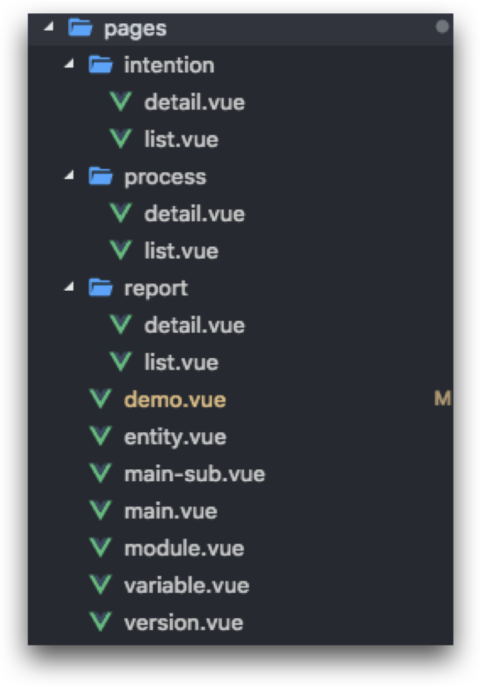
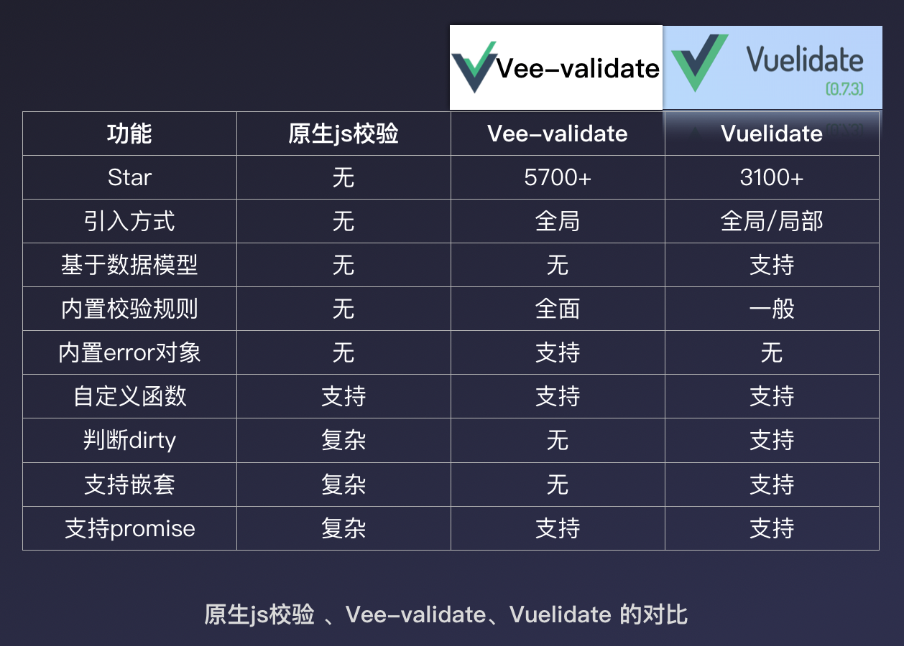
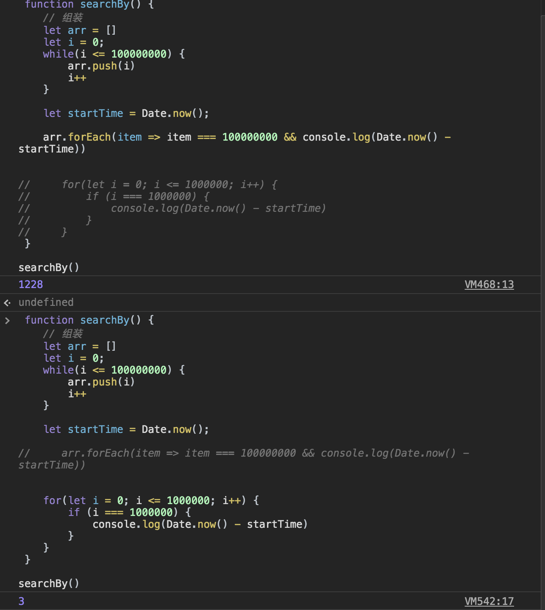
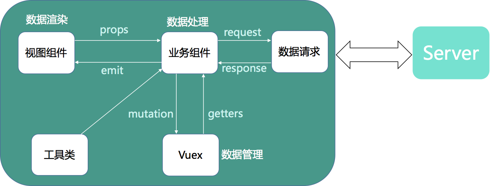

# 项目笔记
> 记录在项目中的一些心得、踩坑笔记

[[toc]]


## 网易社招官网（PC、H5）


### 职责
 - 项目搭建（前端脚手架）
 - 国际化调研/配置
 - 首页开发（轮播组件）
 - 兼容性处理
 - Nginx配置

### 亮点
 - 多页应用。（编译、打包速度快）
 - 兼容多端、多浏览器
 - 语言切换支持静默刷新

### 难点
 <!-- - [多页应用配置](#多页应用配置) -->
 - [兼容性处理](#兼容性处理)
 - [国际化处理](#国际化处理)
 - [react-router封装](#react-router封装)
 - [跑马灯思路](#跑马灯思路)

#### 兼容性处理
**PC**

【HTML方面】
 - FireFox不兼容Video标签：
    在`FireFox`上无法通过`<video>`标签播放视频：
    ```html
    <!-- before -->
    <video data-id="2" data-prime="true" data-time="5000" loop preload="none" playsInline autoPlay>

    <!-- after -->
    <video data-id="2" data-prime="true" data-time="5000" loop preload="none" playsInline autoPlay muted={true}>
    ```
    解决方法：添加一个`muted`属性，值为`true`即可。
    > `muted`属性用来设置该段视频是否被静音

【CSS方面】
 - 不同浏览器下，默认margin、padding、列表缩进不同
    - 引入 `全局css reset` 文件

 - IE浏览器不兼容filter滤镜
    - 解决：设置`filter:progid:DXImageTransform.Microsoft.`（.后面是紧跟各种滤镜，约十几种）

【JS方面】
 - IE9及以下不兼容`requestAnimationFrame`
    ```js
        window.requestAnimationFrame = window.requestAnimationFrame || function(a){return setTimeout(a, 1000 / 60)};//时间刻自行设置
        window.cancelAnimationFrame = window.cancelAnimationFrame || clearTimeout;
    ```
 - IE9以下的事件绑定
    - 解决：判断是否支持`window.addEventListener`（用柯里化可提前返回`window.addEventListener`）
    
**H5**

【HTML方面】
 - 在微信IOS下，**不支持自动播放视频**
    - 原因：Apple解释是为了节省流量。
    - 解决办法：页面加载后，获取Video的dom节点，模拟`play()`

【CSS方面】
 - 安卓低版本（4.4）**line-height**不居中
    - 初步怀疑：字体大小为奇数、使用 `rem` 单位造成（由于根元素会动态改变）
    - 解决：把用到 `line-height` 设置垂直居中的标签都换成`button`
 
 - 点击元素时出现**背景色**
    - 解决：`-webkit-tap-hightlight-color: rbga(0, 0, 0, 0)`；换成`<div>`

【JS方面】
 - 安卓低版本（4.4）页面空白
    - 初步怀疑：css属性漏掉autoprefixer前缀的兼容问题
    - 进一步怀疑：（VConsole控制台显示**Promise is undefined**）
    - 解决：引入全局polyfill -> babel对polyfill的按需引入（`useBuiltIns: usage`）
 
 - 微信内置浏览器的**键盘遮住**输入框
    - 解决：对输入框绑定click事件，再通过一个setTimeout，取得DOM节点，用它执行`Element.scrollIntoView()`

[查看](/skill/project/compatibility/h5/)


#### 国际化处理
主要问题：
 - **[语言工具]** 考虑代码维护性、兼容性、静默刷新
 - **[语言方案]** 页面内容、Ant组件（提示）、登录组件、后端接口部分

解决方案：
 - **语言工具**
    - 两套页面
        - 维护性差，时间成本高。
    - react-intl
        - 原理：通过HOC，来向当前组件包裹注入intl属性
        - 优点：从根组件注入
        - 缺点：1、只能应用于`React.Component`（无法用于纯JS的工具方法文件）；2、组件实例的ref会改变；3、因为组件被HOC包裹，组件的属性不会被子类继承；
    - react-intl-universal
        - 优点：1、对于`React.Component`、`JS工具方法`都能应用；2、组件实例不会改变；3、使用简单（3个API和一些可选属性）；3、可以按需注入

 - **语言方案**
    - 根组件声明语言种类`lang`，并注入到context
    - 页面、业务组件
        - 编写独立locale跟随业务文件，在页面中按需引入并根据`lang`实例化intl对象
    - Ant组件
        - 给最外层`ConfigProvider`组件的`locale`属性赋值（`antd语言包`）
    - 登录组件（输入控件、验证码）
        - 在初始化URS登录控件时传参`lang`，指定语言版本
    - 后端接口部分
        - 接口请求。统一配置请求头`lang`字段
        - 接口响应。统一拦截响应：code（402001）、msg
        - 字典接口。与后端约定好，同一字段在不同语言下的命名格式（`name`、`en_name`），前端根据`lang`取相应语言的变量


#### react-router封装
特点：
 - 实现路由配置化
 - 统一管理路由表
 - 避免组件命名冲突
 - 自动实现组件懒加载

**内部方法**：
 - **SuspenseComponent**
    - 实现组件懒加载

**暴露方法**：
 - **getRouteInfo**：获取当前路由信息、上级路由信息
    - 根据路由表、当前路径，获取当前路由信息，以及上级路由信息

 - **getRouteLine**：获取路由的渲染路径（常用于`面包屑`）
    - 根据路由表、当前路径，利用递归查找

 - **Routes**：渲染出口（类似`<router-view>`）
    - 根据当前渲染路由，自动生成`<Switch>`组

#### 跑马灯思路
**使用：**

【业务层】
 - 编写`useMarquee`，暴露`startTime`、`stopTime`、`<MarqueeWrapper>`
 - 分别用`<MarqueeWrapper>`包裹两组一样的图片，后者设置offset
 - `useMarquee`内封装了`_move`方法，用来改变特定的dom节点的`transform`属性
 - 利用定时器，执行两组图片的`move`

```js
// _move代码
const _move = (dom, order, { speed, offset }) => {
    const width = dom.clientWidth; // 每一组的宽度
    // 计算该节点translateX坐标
    let coord = document.defaultView.getComputedStyle(dom, null).transform.split(',');
    let x = coord[coord.length - 2] || 0;
    let newX = x <= -width * (order + 1) ? -width * (order - 1) : x;
    // 设置该节点的translateX坐标
    dom.style.transform = `translate(${newX - speed - offset}px, 0)`;
};
```

#### 多页应用配置
 - 其他：
    - 单入口启动
    - DLL动态链接库（没有指定`devtool`: `cheap-module-eval-source-map`）
    - ts的类型检查（【开发时监听】`tsc --noEmit -w`；【打包时】`tsc --noEmit`）
    - Nginx配置：
        - 因为是个多页应用（BrowserRouter）。**手动刷新**浏览器会尝试从服务器取资源。
        - 需通过以下Nginx配置将资源 **重定向到前端静态资源** 去寻找。
            ```js
            location /test.html {
                root /home/appops/my-static/myProject/build;
                index test.html;
                try_files $uri /test.html;
            }
            ```

## 网易智能客服机器人——网易波特（PC）


### 职责
 - 项目重构（Regular.js -> Vue.js）
 - 基础组件库开发
 - 调研/引入校验框架
 - 引入登录功能、NOS上传封装

### 亮点
 - 重components、轻pages（页面结构清晰）
 - 组件库轻量
 - 数据检验灵活
 - 资源模块化




### 难点
 - [数据校验调研](#数据校验调研)
 - [列表数据庞大下，渲染卡顿体验性差](#列表数据庞大，渲染卡顿体验性差)
 - [列表数据庞大下，查找指定数据](#列表数据庞大，查找指定数据)

#### 数据校验调研
主要针对以下方面进行调研：
 - 引入方式（全局/局部）
 - 支持自定义校验规则
 - 支持Promise
 - 支持嵌套




比较发现，`Vuelidate`相对比较轻量，支持局部引入，**还支持嵌套校验、基于数据模型。**

**Vuelidate**源码实现：
 - 实例化vue时，会通过`this.$options`读取该 vue实例 选项的`validations`
 - 会把选项里的`配置规则`转化为`$v`属性
 - 将`$v`的代理通过`mixin`的方式，加入到 vue实例 的`computed`选项，进行双向绑定


#### 列表数据庞大，渲染卡顿体验性差
主要问题：列表数据庞大（10w），渲染卡顿体验性差。（分页不可取）时间分片

解决方案：
 - **方案一：一次性渲染**
    - 现象：白屏时间长**9s（白屏6s Script、3s Rendering）**
    - 在`js执行完且渲染前`、`setTimeout内`分别输出`Date.now`，发现：JS执行并不是瓶颈，而是渲染阶段
    - 方案不可用原因：白屏时间过长，体验性极差

 - **方案二：使用`setTimeout`分批渲染**
    - 现象：白屏缓解，但会出现闪屏（白屏1.5s，0.5s Script、1s Rendering）
    - `FPS`表示每秒钟画面更新次数，大多数显示器刷新频率60Hz（即每秒钟重绘60次，FPS = 60 frame/s）
    - `帧率小于40 FPS`时，人会开始感觉卡顿
    - 不可用原因：1、`setTimeout`执行时间不确定（由于主线程执行完才会去检查事件队列）；2、不同显示器FPS不同，但`setTimeout`设定固定间隔；3、可能出现丢帧

 - **方案三：使用`requestAnimationFrame`**
    - 现象：白屏缓解，不会出现闪屏（白屏1.2s，0.2s Script、1s Rendering）
    - 不会丢帧。保证回调函数 **在屏幕每次更新的间隔里** 只被执行一次
    - 不兼容 **IE10以下**

 - **方案四：使用`requestAnimationFrame`+`DoccumentFragment`**
    - 现象：与 方案三 没有明显变化，但滑动更流畅
    - `DocumentFragment`内容变化不会触发DOM树重新渲染，不会导致性能问题
    - `document.createDocumentFragment`方法或者构造函数来创建一个空的DocumentFragment
 
 - **更优方案：使用`vue-virtual-scroller`**
    - 现象：性能好
    - 原理：将 **加载事件** 绑定在 `scroll事件` 上，并记录上次渲染的`startIndex`、`endIndex`，利用一个buffer进行存储。局部渲染、自动回收DOM
    - 缺点：设置固定高度

<!-- 
#### 列表数据庞大下，查找指定数据
主要问题：列表数据庞大（10w），根据关键字（实体词）精确查找数据（同义词）

解决方案：
 - **方案一**：后端查找，接口返回
    - 增加http请求
    - 
 - **方案一：for、while、forEach循环**
    - 根据关键字，进行for循环（while差不多）
    - forEach性能更差
    - 时间复杂度：`O(n)`
 - **方案三**：哈希查找
    - 在首次读取时，顺带放入js实现的哈希表中存储
    - 下次直接key-value形式读取
    - 时间复杂度：`O(1)`


```js
// 数据结构：
// const entityList = [
//     {
//         entity : '番茄',
//         similarity : '西红柿、圣女果'
//     },
//     {
//         entity : '土豆',
//         similarity : '马铃薯、薯仔'
//     }
// ];

function Hashtable() {
    this._hashValue = {};
}

Hashtable.prototype.add = function (inputArray) { //处理接口数据
    for(let i = 0; i < inputArray.length; i++) {
      this._hashValue[inputArray[i]['key']] = inputArray[i]['value'];
    }
    return this._hashValue;
}


Hashtable.prototype.get = function (key) { //根据id获得src
    if(typeof key === 'string' && this._hashValue[key]) {
        return this._hashValue[key];
    }
}

const createHash = new Hashtable();

createHash.add(picArray);
console.log(createHash._hashValue);
console.log(createHash.get('123')); // hhh
``` -->

#### [vuelidate]表单校验
调研思路：
  - 基于数据模型
  - 支持自定义函数
  - 支持嵌套
  - 支持Promise
  - 引入方式（可全局、可局部）
 
源码实现（数据响应）
  - 当实例化一个vue时，会通过`this.$options`获取该vue实例选项里的`validations`
  - 再把选项里的`配置规则`转化为`$v`属性
  - 将`$v`的代理通过`mixin`的方式，加入到Vue实例中的`computed`选项
  - 默认是通过`input`事件进行校验。作者也推荐开发者可以通过给`v-model`定义`.lazy`修饰符，使得校验器可以进行懒校验
 


## 网易校招Mini项目——觅见日记（小程序）


### 职责
  - 微信登录/授权部分
  - 调研并引入fly.js
  - 前端资源模块化
  - UI设计

### 亮点
  - 请求响应统一拦截配置
    - 根据不同的code对响应进行不同的逻辑处理
  - LS以及Vuex巧妙搭配
    - LS作为存储方、Vuex作为提供方

### 难点
 - [登录态、userInfo的获取与存储](#登录态、userinfo的获取与存储)
 - [登录态的统一拦截判断](#登录态的统一拦截判断)
 - [资源模块化](#资源模块化)

 
#### 登录态、userInfo的获取与存储
 主要问题：**在不影响用户使用的前提下，减少HTTP请求，减少重新授权操作。**

 - 需判断微信服务端中的 **session_key是否过期**
 - 登录态、userInfo在前端的存储，**减少HTTP请求**
 - 为已授权的用户的userInfo存储到后端，**减少重新授权操作**

 解决方案：
  - 采用了`LS（存储方）` + `Vuex（提供方）`搭配方式。
    - 小程序加载，检查`LS`里的`登录态`：
        - 若有，将`登录态`加到请求头；将`userInfo`存到`vuex`。（`LS`在，则证明`userInfo`也在）
        - 若没有，发起`wx.login()`，利用`code`和服务端换取新的`登录态`。随后将`登录态`存到`LS`，并配进请求头；通过与后端拉取`userInfo`，存到`LS`、`Vuex`
    - 用户授权时，微信会返回最新`userInfo`，再更新`userInfo`到后端
    - **总结：LS存放登录态、userInfo；Vuex存放`userInfo`；请求头携带`登录态`**

:::tip
**小程序登录过程：**
  - 微信
    - 小程序端调用`wx.login()`获取`code`
    - 带着`code`，传递给开发者后端
    - 开发者后端带着`code + appid + appsecret`跟微信后端换取`session_key + openid`
    - 开发者后端将`自定义登录态`与`session_key + openid`关联，并响应给小程序`登录态`
      - 并将session_key和openid存到redis里，过期后会重新请求
    - 小程序把`登录态`写入Storage，等到下次有需要登录权限时，从Storage获取
    - 开发者后端通过`自定义登录态`去查询`session_key + openid`，返回业务数据

  - 支付宝
    - 小程序端调用`getAuthCode`，向支付宝App获取`auth_code`
    - 小程序端携带`auth_code`给开发者后端，发起登录验证请求
    - 开发者后端通过`auth_code`与支付宝授权平台获取`token`和`uid`
    - 开发者将`token`和`uid`种到session里，并响应给小程序端验证成功
    - 在session有效期内，不需重复授权
:::

#### 登录态的统一拦截判断
 主要问题：**请求 具有登录权限的接口 时，根据返回的登录态进行统一响应拦截处理**

 解决方案：
   - 在`请求拦截器`中统一加入与后端约定好的`登录态`自定义属性
   - 在`响应拦截器`进行判断：
        - 判断后端返回的`data.code`：
            - 3 - 判断为首次登录，需将响应返回的`登录态`记录到`LS`；
            - 2 - `登录态`失效、发起`wx.login()`，**完成自动登录**后重新再次发起这个请求；（设定session无效、重新尝试的最大次数）
            - 1 - 服务端异常，统一出现报错提示
            - 0 - 请求正常，返回响应结果

#### 资源模块化
主要问题：**体现 “重components，轻pages” 的特点；资源模块化；可维护性**

解决方案：**按照模块的功能，将资源划分为5块：视图组件、业务组件、数据管理、工具类、数据请求**
 - 视图组件：负责数据呈现、向业务组件传递属性、处理从业务组件发射的事件
 - 业务组件：负责数据处理：请求发起/响应处理、Store里数据的获取/变更、工具类的调用
 - 数据请求：负责接口请求、响应的统一拦截配置、接口文件管理
 - 数据管理：全局Store的管理：按模块去管理vuex实例配置，引入命名空间
 - 工具类：提供处理数据的公用方法。




