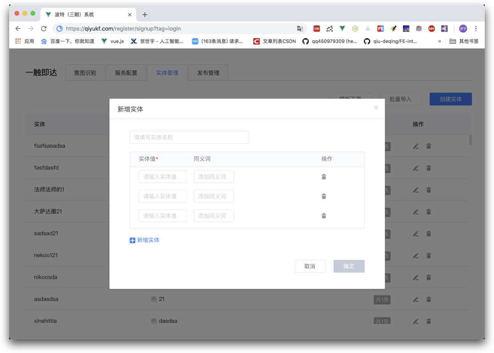
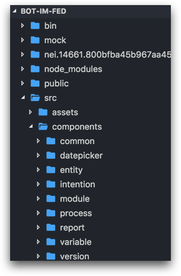
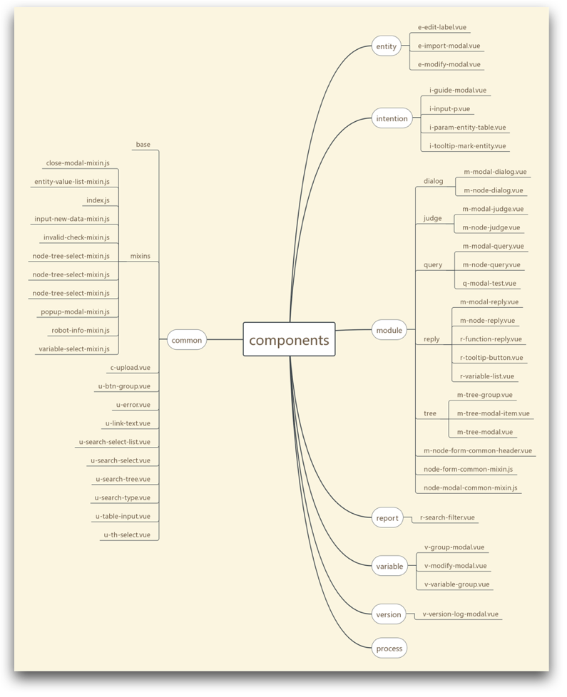

# Bot（PC）
> 项目时间：2018-09 ~ 2019-05

[[toc]]



## 职责
 - 项目重构（Regular.js -> Vue.js）
 - 基础组件库开发
 - 调研/引入校验框架
 - 引入登录功能、NOS上传封装

## 亮点
 - 重components、轻pages（页面结构清晰）
 - 组件库轻量
 - 数据检验灵活
 - 资源模块化






## 难点
 - [数据校验调研](#数据校验调研)
 - [列表数据庞大下，渲染卡顿体验性差](#列表数据庞大，渲染卡顿体验性差)
 - [列表数据庞大下，查找指定数据](#列表数据庞大，查找指定数据)

### 数据校验调研
主要针对以下方面进行调研：
 - 引入方式（全局/局部）
 - 支持自定义校验规则
 - 支持Promise
 - 支持嵌套


比较发现，`Vuelidate`相对比较轻量，支持局部引入，**还支持嵌套校验、基于数据模型。**

**Vuelidate**源码实现：
 - 实例化vue时，会通过`this.$options`读取该 vue实例 选项的`validations`
 - 会把选项里的`配置规则`转化为`$v`属性
 - 将`$v`的代理通过`mixin`的方式，加入到 vue实例 的`computed`选项，进行双向绑定


### 列表数据庞大，渲染卡顿体验性差
主要问题：列表数据庞大（10w），渲染卡顿体验性差。（分页不可取）时间分片

解决方案：
 - **方案一：一次性渲染**
    - 现象：白屏时间长**9s（白屏6s Script、3s Rendering）**
    - 在`js执行完且渲染前`、`setTimeout内`分别输出`Date.now`，发现：JS执行并不是瓶颈，而是渲染阶段
    - 方案不可用原因：白屏时间过长，体验性极差

 - **方案二：使用`setTimeout`分批渲染**
    - 现象：白屏缓解，但会出现闪屏（白屏1.5s，0.5s Script、1s Rendering）
    - `FPS`表示每秒钟画面更新次数，大多数显示器刷新频率60Hz（即每秒钟重绘60次，FPS = 60 frame/s）
    - `帧率小于40 FPS`时，人会开始感觉卡顿
    - 不可用原因：1、`setTimeout`执行时间不确定（由于主线程执行完才会去检查事件队列）；2、不同显示器FPS不同，但`setTimeout`设定固定间隔；3、可能出现丢帧

 - **方案三：使用`requestAnimationFrame`**
    - 现象：白屏缓解，不会出现闪屏（白屏1.2s，0.2s Script、1s Rendering）
    - 不会丢帧。保证回调函数 **在屏幕每次更新的间隔里** 只被执行一次
    - 不兼容 **IE10以下**

 - **方案四：使用`requestAnimationFrame`+`DoccumentFragment`**
    - 现象：与 方案三 没有明显变化，但滑动更流畅
    - `DocumentFragment`内容变化不会触发DOM树重新渲染，不会导致性能问题
    - `document.createDocumentFragment`方法或者构造函数来创建一个空的DocumentFragment
 
 - **更优方案：使用`vue-virtual-scroller`**
    - 现象：性能好
    - 原理：将 **加载事件** 绑定在 `scroll事件` 上，并记录上次渲染的`startIndex`、`endIndex`，利用一个buffer进行存储。局部渲染、自动回收DOM
    - 缺点：需要设置固定的 父容器、子元素高度

<!-- 
#### 列表数据庞大下，查找指定数据
主要问题：列表数据庞大（10w），根据关键字（实体词）精确查找数据（同义词）

解决方案：
 - **方案一**：后端查找，接口返回
    - 增加http请求
    - 
 - **方案一：for、while、forEach循环**
    - 根据关键字，进行for循环（while差不多）
    - forEach性能更差
    - 时间复杂度：`O(n)`
 - **方案三**：哈希查找
    - 在首次读取时，顺带放入js实现的哈希表中存储
    - 下次直接key-value形式读取
    - 时间复杂度：`O(1)`


```js
// 数据结构：
// const entityList = [
//     {
//         entity : '番茄',
//         similarity : '西红柿、圣女果'
//     },
//     {
//         entity : '土豆',
//         similarity : '马铃薯、薯仔'
//     }
// ];

function Hashtable() {
    this._hashValue = {};
}

Hashtable.prototype.add = function (inputArray) { //处理接口数据
    for(let i = 0; i < inputArray.length; i++) {
      this._hashValue[inputArray[i]['key']] = inputArray[i]['value'];
    }
    return this._hashValue;
}


Hashtable.prototype.get = function (key) { //根据id获得src
    if(typeof key === 'string' && this._hashValue[key]) {
        return this._hashValue[key];
    }
}

const createHash = new Hashtable();

createHash.add(picArray);
console.log(createHash._hashValue);
console.log(createHash.get('123')); // hhh
``` -->
