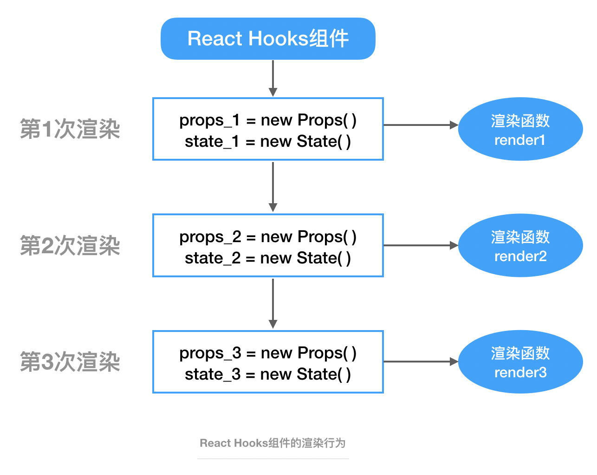

# React Hooks
> Hook是React 16.8的新特性。它可以让你在不编写class的情况下使用state以及其他的React特性。
> 
> —— React官网

[[toc]]

:::tip
相对于Class组件
 - 没有复杂的生命周期
 - 没有类组件的this指向
 - 没有类似于HOC、render props等复用模式
:::

## 【引言】React两种组件的渲染行为
### Hooks组件
Hooks组件每次render都是调用不同的渲染函数，所以**拥有完全独立的函数作用域**。
> 后续的render每次都会生成全新且独立的props、state



### 类组件
类组件每次render都是调用同一个渲染函数。
> 后续的渲染只会改变this.props、this.state的值，而不是引用地址（唯一的this.props、this.state只在初始化时的构造函数中生成）


## Hooks组件内部的使用注意
由上面的渲染行为可知，Hooks组件的每次render都会拥有独立的作用域，所以利用Hooks开发时，有一些需要我们注意的使用方式。他们分别是：
 - 函数、变量的声明位置
 - useRef——不变常量的声明方式
 - useEffect的生效时机

### 函数、变量的声明位置
所以**组件内部的函数、变量在每次render时都会重新声明**，因此我们应该减少在Hooks组件内部声明函数、变量。

#### 1、函数与组件内state、props无相关性
这种函数的返回结果一般仅供展示：
```js
function formatName(name) {
    return `Hello, your name is ${name}`
}

function App(props) {
    const [name, setName] = useState('heshiyu');

    return (
        <div>
            <div>{formatName(name)}</div>
            <button onClick={() => setName('new life')}>Click Me!</butotn>
        </div>
    )
}
```

#### 2、函数与组件内state、props强相关性

### useRef——不变常量的声明方式
如果我们需要一个对象，希望它从一开始到之后的每次render都是不变的。

:::tip
常见情况：
 - 需给自定义hooks传入参数时
 - 引用某个指定的dom实例时
:::
> “不变”指的是不会重新生成，**可变其值，但不可变其址**

这时候，**useRef**就派上用场了！

#### 需给自定义hooks传入参数时
```js
function App(props) {
     // 使用useRef，返回一个稳定状态的引用值，避免死循环
    let ref = useRef({ resumeAll: true });
    // 此处useFetch是一个用于获取后端数据、且依赖于传入的请求参数的自定义Hooks（第二个参数表示接口请求参数）
    const { data = {}, isLoading } = useFetch(getResumeInfo, ref.current);
}
```

#### 引用某个指定的dom实例时
例子1（待补充）：
```jsx
function App(props) {
    const videoRef = useRef();
    const start = () => {
        videoRef.current.play();
    };
    
    return (
        <div>
            <video ref={videoRef}>
                <source src="https://www.163.com/happy.mp4" type="video/mp4" />
                你的浏览器不支持该视频格式
            </video>
            <button onClick={start}>Play!</button>
        </div>
    )
}
```

例子2：
```jsx
// 1、有一个自定义Form表单：CustomizedForm
class CustomizedForm extends React.Component { ... }

// 2、经过 Form.create 包装后，组件EnhancedForm会自带 this.props.form 属性（该属性拥有各种对该form表单的各种操作方法）
const EnhancedForm =  Form.create()(CustomizedForm);

// 3、有一个App组件，调用了这个EnhancedForm表单组件...
function App(props) {
    let formRef = useRef();

    const onSubmit = () => {
        const { form } = formRef.current;
        form.validateFields((err, values) => {
            if (err) return;

            addData({ moduleType, [option.key]: formatParam(values) }).then(data => {
                formValueCache.current = {};
                setVisible(false);
                dispatch();
            });
        });
    };
    
    // 4、对被 Form.create 包装过的组件，可通过 wrappedComponentRef 这个属性拿到它的ref
    return <EnhancedForm wrappedComponentRef={(form) => (formRef.current = form)} />
}
```
这样之后，`formRef.current`指向的就是CustomizedForm表单的实例了。

## 一些常用的Hooks


## 参考链接
[React Hooks工程实践总结](https://juejin.im/post/5de4e47f6fb9a07160543ebb)

[React Hook](https://zh-hans.reactjs.org/docs/hooks-intro.html)