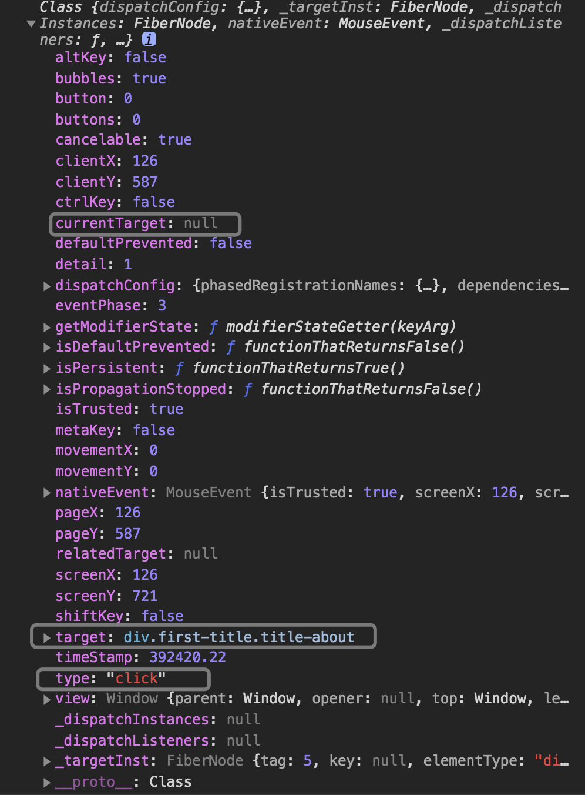
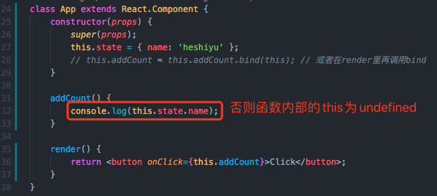

# React基础知识
> 收录了v15、v16通用的基础知识点（轻量级）。

[[toc]]

## 单向数据流
**单向数据流**：把整个react应用看作一个瀑布，那props就是瀑布水流的额外水源。
```jsx
<Component data={this.state.data}>
```
 - `Component`组件不知道`data`来源。
 - 任何state总是所属于某个特定的组件，而且从该state派生的任何数据或UI（Any data or UI derived from that state）只能影响比它们下方的组件。

## 受控组件与非受控组件
**受控组件：** 由 `state` 管理输入值，由 `事件处理函数` 去修改state。
> 会阻止用户输入

`<input type="text">`、`<textarea>`这类标签都接受一个`value`属性，可以利用它实现受控组件。


### 非受控组件
我们可以使用`ref`去获取DOM节点的value值。
> you can use a `ref` to get from values from the DOM.

```js
this.input = React.createRef()

console.log(this.input.current.value) // this.input.current拿到DOM节点

<input ref={this.input} />
```
由上，可以通过ref来读取当前input的value。

> 不需要像 **受控组件** 一样去定义state挂在value上、编写onChange事件去取value从而改变state

对于非受控组件，我们可以定义一个`defaultValue`而不是`value`，来达到给组件赋予初始值，而不控制后续更新。
> With an uncontrolled component, you often want React to specify the initial value, but leave subsequent updates uncontrolled. You can specify a `defaultValue` attribute instead of `value`

### 受控组件 vs 非受控组件
在受控组件中，表单数据是由`React组件`来管理

在非受控组件中，表单数据是由`DOM节点`来处理。

## Context
Context可以用来共享“全局”（一个组件树）的数据。

### 创建Context对象
```js
const MyContext = React.createContext(defaultValue); // 创建一个Context对象
// defaultValue会在 当组件所处的树中没有匹配到Provider时 使用。
```


### 定义Context.Provider
```jsx
<MyContext.Provider value={/* 某个值 */}>
    /* ... */
</MyContext.Provider>
```
`Provider`接收一个`value`属性，传递给消费组件。

当 value 值变化时，它内部的所有消费组件都会重新渲染。


### 订阅Context变更
订阅 context 变更一共有 3种方法：`Class.contextType`、`Context.Consumer`、`useContext`。
> 每一种订阅模式，都不会受到中间组件`shouldComponentUpdate`的影响，即子组件依旧能触发更新。

#### Class.contextType
将`Context对象`挂载到class上的`contextType`属性，可以订阅到 context 变更。这样就可以通过`this.context`取得`Context`的值。

> `this.context`可以在任何生命周期（包括render函数）中使用

以下 Way1、Way2 是等价的：
```js
class MyClass extends React.Component {
  // Way1: 
  static contextType = MyContext;

  render() {
    let value = this.context;
  }
}

// Way2: 
// MyClass.contextType = MyContext;
```

#### Context.Consumer
`Context.Consumer`也可以订阅到 context 变更。

```jsx
<MyContext.Consumer>
    {value => /* */}
</MyContext.Consumer>
```
指定子组件为一个函数。回调里的`value`就是最近的 Provider提供的value。

#### useContext
对于函数式组件，也可以通过`useContext`订阅到 context 变更：
```js
function ThemedButton(props) {
    const value = useContext(MyContext); // 把Context对象传入useContext
}
```

### Demo
**theme-context.js**：（创建context对象）
```js
export const MyContext = React.createContext('init')
```

**app.js**（生产者）：
```js
// 引入context对象
import { MyContext } from './theme-context';

class App extends React.Component {
    render() {
        return (
            // 定义Provider，提供value值
            <MyContext.Provider value={'这里是根组件的水源'}>
                <Toolbar />
            </MyContext.Provider>
        );
    }
}

function Toolbar() {
    return (
        <ThemedButton />
    );
}
```

**themed-button.js**（消费者）：
```js
// 引入context对象
import { MyContext } from './theme-context';

class ThemedButton extends React.Component {
    render() {
        let theme = this.context; // Using this.context to consume the nearest current value of that Context type

        return /**/;
    }
}

// 订阅了context变化，能读取this.context
ThemedButton.contextType = MyContext;
```

对于函数式组件：
```js
function ThemedButton(props) {
    // 订阅了context变化，能读取this.context
    const value = useContext(MyContext); // 把Context对象传入useContext
}
```

## 合成事件
**React合成事件**返回的是`SyntheticEvent实例`，能够兼容不同浏览器。

**触发时机：** 冒泡阶段（如：onClick、onChange）。
> 如果**需要注册捕获阶段的事件处理函数**，可以在事件名后紧接`Capture`（如：onClickCapture）

### 合成事件、原生事件的区别 
| 方面 | 原生事件 | 合成事件 |
| --- | ------- | ------ |
| 兼容性 | 不兼容跨浏览器 | 返回的是`SyntheticEvent实例`，能够兼容不同浏览器 |
| 绑定事件处理程序 | 传入字符串，函数的执行 | 传入函数 |
| 阻止默认行为 | 返回`false` | 显示调用`ev.preventDefault()` |

### SyntheticEvent实例
特点：
 - 兼容所有浏览器
 - 拥有原生事件接口（`stopPropagation`、`preventDefault`）
 - 由于合并而来，可能会被重用 **（即在事件回调触发完毕后，所有属性都会失效）**



## 触发Render的方式
 - 首次加载（`ReactDOM.render()`）
 - setState()
 - props发生改变
 - forceUpdate()

其中，`setState`、`props`发生改变都可以通过`shouldComponentUpdate`决定**是否执行render**
> 注意：
> 1、只是render的执行与否，数据还是会修改掉的
>
> 2、只要在相同的DOM节点中渲染`<Clock />`，就仅有一个Clock组件的class实例被创建使用。


## 函数内部的this绑定
### 利用bind
```jsx
class HomeIndex extends Component {
    constructor(props) {
        super(props);
        this.state = { name: 'heshiyu' };
        this.addCount = this.addCount.bind(this); // 或者在render里再调用bind
    }

    addCount() {
        console.log(this.state.name);
    }

    render() {
        return <button onClick={this.addCount}>Click</button>;
    }
}
```

### 利用箭头函数
```jsx
class HomeIndex extends Component {
    constructor(props) {
        super(props);
    }

    addCount = () => {
        console.log(this.state.name);
    }

    render() {
        return <button onClick={this.addCount}>Click</button>;
    }
}
```




## 为什么React要用className？
因为`class`在JavaScript里是关键字，而JSX是JavaScript的扩展。

## ref对象
ref对象：是[可变的](/skill/js/other/#可变（mutable）和不可变（immutable）对象的区别)对象（每次都是修改其下的`.current`属性），并且在整个生命周期内保持不变。

### 通过createRef和useRef来创建ref对象
这两种方式都可以创建ref对象，但有区别。

#### createRef
一般我们会在`constructor`里定义ref对象：
```js
class MyComponent extends React.Component {
  constructor(props) {
    super(props);

    this.inputRef = React.createRef(); // <-- 通过createRef创建ref对象
  }
}
```
也正是React的生命周期，让`createRef`只执行了一次。

但实际上，每次调用它都会**重新生成一个ref对象**（引用地址会发生改变），[What's the difference between useRef and createRef?](https://stackoverflow.com/questions/54620698/whats-the-difference-between-useref-and-createref)

由于引用地址发生变化，对于函数式组件就需要使用`useRef`

#### useRef
```js
function App() {
    const inputRef = useRef(null); // <-- 通过useRef创建ref对象
}
```
在函数式组件内，通过`useRef`返回的ref对象可以在整个生命周期内保持不变。


#### 结论
createRef：
 - 一般用于`Class Component`
 - 每次重新渲染都会使得引用地址发生变化（在生命周期内定义时除外）

useRef：
 - 一般用于`函数式组件`
 - 每次重新渲染不会导致引用地址发生改变

### ref的作用
 - 当`ref`用于HTML元素时，其`.current`属性为`对应的DOM元素`
 - 当`ref`用于`Class Component`时，其`.current`属性为`组件的实例`

以下打印了两者的`.current`属性：


### 将ref作用于函数式组件（forwardRef搭配useImperativeHandle）
若ref用于`函数式组件`，因为它没有实例，react会提示你用`forwardRef`

那就需要将`forwardRef`搭配`useImperativeHandle`使用，来转发这个ref

但最终，还是需要让ref来指向一个DOM元素或者`Class Component`。

#### 转发ref
假设有一个`函数式组件CustomInput`

```js
const CustomInput = forwardRef((props, ref) => {
    const inputRef = useRef();
    
    useImperativeHandle(ref, () => ({
        focus: () => {
            inputRef.current.focus();
        }
    }));

    // 最终还是需要让ref来指向一个DOM元素（或一个Class Component）
    return <input ref={inputRef} />;
})
```
这样，当父组件（即：引用`<CustomInput ref={myRef} />`的那个组件）就可以通过`myRef.current`来拿到`CustomInput`里的input元素了。
