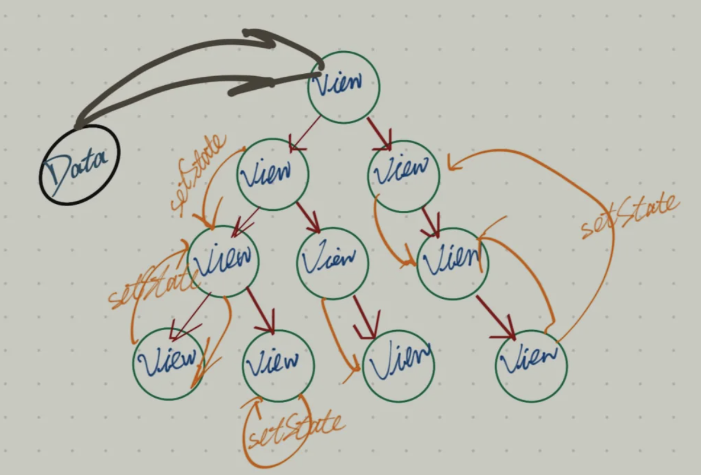

# 组件间通信

[[toc]]

## 单向数据流
**单向数据流**：把整个react应用看作一个瀑布，那props就是瀑布水流的额外水源。
```jsx
<Component data={this.state.data}>
```
 - `Component` 组件内部不知道 `data` 来源

## React.Context
通过 `Context`，为 一个组件树（或子组件树） 共享一些“全局”的状态。

### 创建Context对象
```js
const MyContext = React.createContext();
```


### 定义Context.Provider
```jsx
<MyContext.Provider value={myValue}>
    /* ... */
</MyContext.Provider>
```
`Provider` 的 `value`属性 会传递给 `Consumer`组件。

### 订阅Context
订阅 context 的 3 种方法：
 - `<Context.Consumer>`
 - `Class.contextType`（Class组件）
 - `useContext`（Hook组件）

```js
// 一、 <Context.Consumer>
<MyContext.Consumer>
    {value => /* */}
</MyContext.Consumer>


// 二、Class.contextType
class MyClass extends React.Component {
  static contextType = MyContext;

  render() {
    let value = this.context;
  }
}

// 三、useContext
function ThemedButton(props) {
    const value = useContext(MyContext); // 把Context对象传入useContext
}
```
#### 关于渲染
当 `value` 发生变化， `Consumer` 组件 不会受到中间组件 `shouldComponentUpdate` 的影响， **依旧会正常触发渲染** 。


### 最佳实践
**withContext.js**：
```js
import React from 'react';

// 1. 创建 Context 对象
const Context = React.createContext({}); 

// 2. 获取 Provider、Consumer 组件
const { Provider, Consumer } = Context;

// 3. 定义 HOC，使用 Consumer 包裹
const withContext = Component => props => (
    <Consumer>{value => <Component {...props} {...value} />}</Consumer>
);

// 4. 导出 Provider组件 以及 HOC 组件，分别给 顶层组件、消费组件 使用。
export { Provider, withContext };
```

**app.js（顶层组件）**：
```js
import { Provider } from '@/components/withContext';

ReactDOM.render(
    <Provider
        value={{
            userInfo,
            currentId,
            setCurrentId
        }}>
        <Index />
    </Provider>,
    document.getElementById('app')
);
```

**my-component.js（消费组件）**：
```js
import { withContext } from '@/components/withContext';

function MyComponent(props) {} // 经过 HOC，props内可读取到 <Context.Provider> 提供的 value

export default withContext(MyComponent);
```


## react-redux
`react-redux` 是一套 **状态管理方案**，底层是通过 `Redux` 实现的。

**特点**：
 - 遵循 单向数据流
 - 每一个 state 的变化可预测
 - 统一处理校验逻辑

**原则**：
 - **单一数据源：** 整个应用只有唯一的 `Store`；

 - **State只读：** 唯一改变 `state` 的方法就是 `dispatch` 一个 `action`

 - **纯行为函数：** 只能通过一个 纯函数`reducer`  来描述修改。

**使用前 vs 使用后**：

 vs 

### 基本组成
 - **store**：一个全局唯一的 “状态容器”，存储所有状态（`state`）。
 - **state**：状态
 - **action**：`state` 的变更通知
 - **dispatch**：`View` 发出 Action 的媒介
 - **reducer**：接收 `action`、`state`，返回一个 `新的state`

**它们之间的关系**：


### 组成
#### Provider
`<Provider>`是一个容器。

**原理：** 改写 `React.Context.Provider`。
```js
// 通过 React.createContext 创建一个 context 对象
export const ReactReduxContext = React.createContext(null);

function Provider({ store, context, children }) {
  // ...
  return <ReactReduxContext.Provider value={contextValue}>{children}</ReactReduxContext.Provider>
}
```

在业务组件内与 `connect` 配合，可以实现 **跨层级数据传递**。

#### connect
`connect` 是一个高阶组件，接收 2 个函数：
 - `mapStateToProps`：将 “`store` 里的 `state`” 注入到组件的props中

 - `mapDispatchToProps`：将 “`dispatch`、`action`的组合” 注入到组件的props中
```js
// 将 store 里的 color，注入到 当前组件的 props 属性
const mapStateToProps = state => ({
  color: state.color
})
// 将 dispatch + action 的搭配 命名为（changeColor），然后注入到 当前组件的 props 属性
const mapDispatchToProps = (dispatch) => ({
  changeColor: (color) => {
    dispatch(changeColorAction(color));
  }
});
```

除了上面的作用，还有当 `state` 发生变化时，通知关联的组件更新。

```js
import {Component} from "react";
import React from "react";
import {PropTypes} from 'prop-types'

// connect是个纯函数，它返回一个组件的类定义
const connect = (mapStateToProps, mapDispatchToProps) => (WrappedComponent) => {
    class Connect extends Component {
        constructor() {
            super()
            this.state = {}
        }

        componentWillMount() {
            this.unSubscribe = this.context.store.subscribe(() => {
                this.setState(mapStateToProps(this.context.store.getState()))
            })
        }

        componentWillUnmount() {
            this.unSubscribe()
        }

        render() {
            return (
                <WrappedComponent 
                    {...this.state}
                    {...mapDispatchToProps(this.context.store.dispatch)}
                />
            )
        }
    }

    Connect.contextTypes = {
        store: PropTypes.object
    }

    return Connect
}

export default connect
```

#### 使用示例
```js
import React from "react";
import { connect } from "react-redux";
import { changeColorAction } from "./../../redux/action";

class Header extends React.Component {
  setColor = () => {
    const { changeColor } = this.props;
    changeColor("blue");
  };

  render() {
    const { themeColor } = this.props;

    return (
      <div>
        目前的颜色为：{themeColor}
        <button onClick={this.setColor}>改为蓝色</button>
      </div>
    );
  }
}

const mapStateToProps = (state) => ({
  themeColor: state.themeColor
});
const mapDispatchToProps = (dispatch) => ({
  changeColor: (color) => {
    dispatch(changeColorAction(color));
  }
});

export default connect(mapStateToProps, mapDispatchToProps)(Header);
```


#### [实践] react-redux
1、**新建`reducer.js`**：接收 action、state，返回新的 state

2、**实例化`store`**：向 `createStore` 传入 `reducer`

3、**引入`Provider`组件**：传入`store`

4、**注入到`业务组件`**：利用 `connect` 包裹业务组件，将 `state`、`dispatch` 注入到组件

[react-redux-demo](https://codesandbox.io/s/react-redux-demo-k1jbe)

### 参考链接
 - [从 Redux 设计理念到源码分析](https://mp.weixin.qq.com/s/8A-uOiuiMpAfhX0S6YwhbA)
