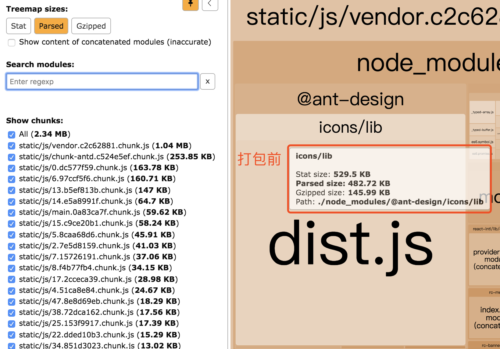

# 性能优化
> 这里会记录下一些有关React的性能优化知识

[React性能优化小贴士](https://juejin.im/post/5d36c40ff265da1b9570997a)

## ant-design-icon打包体积过大
解决方法：
```js
module.exports = {
   configureWebpack: {
      resolve: {
         alias: {
        '@ant-design/icons/lib/dist$': path.resolve(__dirname, '../src/utils/antdIcon.js')
    }
}
```

效果：

优化前：


优化后：


缺点：需手动引入所有Icon
