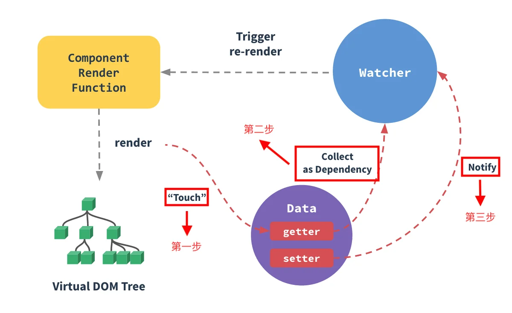

# Vue基础知识
[[toc]]

## 什么是MVVM？
 `M`：Model层，代表 **模型、数据**。负责数据修改、操作的业务逻辑

 `V`：View层，代表 **视图、模板**。负责将数据模型转化UI展现出来

 `VM`：ViewModel层，将 `View` 和 `Model` 连接起来
   - 将 Model层 的数据`同步`到 View层 ，进行渲染
   - 将 View层 的修改`同步`到 Model层 ，进行存储


**Vue框架充当了MVVM开发模式中的 `ViewModel` 层，负责 `View` 和 `Model` 之间通信的桥梁。**


### MVVM的实现原理
如何监听JS对象属性发生了变更？

 - `Vue.js` 通过 **数据劫持**。
 > 当数据变动时，数据会触发劫持时绑定的方法，对视图进行更新。

 - `Angular.js` 通过 **脏检查**。
 > 在各种可能引发状态变更的事件后，启动一次脏检查，来决定是否更新视图。

**数据劫持**、**脏检查** 的相同点：
 - 解析模板
 - 解析数据
 - 绑定模板与数据

## 数据双向绑定


`Vue`是通过 `数据劫持` + `发布订阅` 来实现 **数据双向绑定** 的。

```
 - `initState`过程中，把`props、data、computed`等属性通过`Object.defineProperty`来改造其`getter/setter`属性，并为每一个响应式属性去实例化一个`observer`对象；
 - `observer`对象内部的`dep`对象会记录这个响应式属性的所有依赖；
 - 当响应式属性调用`setter`函数时，通过`dep.notify()`方法去通知所有依赖进行改变，调用`watcher.update()`去完成数据的动态响应。
```

### 数据劫持
在 **初始化Vue实例** 时，会实例化 `Observer` 对象，会对传入的 `data` 进行所有属性的遍历。为每个属性，都通过 `Object.defineProperty` 改造它们的 `getter`、 `setter` 方法。

> （如果 `data[key]` 是对象，进行深度劫持）。

### 发布订阅
同时，对于 每一个属性值 都会绑定一个 `dep` 订阅器对象，负责：
 - 在 `getter` 时的 **依赖收集**
 - 在 `setter` 时的 **发布通知**


其中的 **订阅者** 指的是一个个 `watcher` 实例。

#### 订阅者watcher
模板中每个指令（`v-model="name"`）、数据绑定（`{ { name } }`）都会对应一个 `watcher` 对象。在计算过程中，它把属性（这里为 `name` ）记录为依赖。

当依赖的 `setter` 被调用时，会触发 `watcher` 的重新计算，也就会导致它的关联指令去更新DOM。


### 依赖收集
`依赖收集` 发生在响应式属性的 `getter` 阶段，但不是每次 `getter` 都会收集依赖，会通过 `Dep.target` 来区分。

> 若 `Dep.target`有值，说明是Vue内部依赖收集过程触发的，需先收集依赖`this.dep.depend()`，再返回value；否则直接返回value即可。

> 为什么要用Dep.target代表Watcher实例？答：因为getter函数不能传参
```js
Dep.prototype.depend = function () {
    Dep.target.addDep(this);
}
```

### 异步更新队列
Vue在更新 DOM 时是 **异步** 执行的。只要监听到数据变化，Vue将开启一个队列，并缓冲 **在本次事件循环** 中发生的所有数据变更。目的是为了**避免不必要的计算和DOM操作**。

然后在 **下次事件循环（tick）** 中，`Vue`会刷新队列，并执行更新。

`Vue.nextTick(callback)`的回调函数，会 **在 `Vue` 完成DOM更新后** 立即执行。

## Vue VS React
**相同：**
 - **Virtual DOM**
 - **组件化**
    - 组件内部执行`render` -> VNode树 -> Diff -> 真实DOM
 - **推崇“单向数据流”**
    - 父组件传入数据给子组件，子组件不能直接修改父组件传过来的props

**不同：**
 - **核心思想**
    - React：函数式编程、推崇JSX、组件复用HOC/Hooks
    - Vue：双向绑定、推崇template、组件复用Mixin、单文件.vue
 - **组件的实现方式**
    - React：React.Component类、函数式组件返回的React元素；传入`ReactDOM.render()`去渲染
    - Vue：options对象声明，实例化`new Vue()`，内部方法`initState`等
 - **Diff算法**
    - React：三个策略、三种细粒度Diff；从根组件重新渲染整棵树
    - Vue：五种情况、四次比较、根据Key值查找匹配对象；更细粒度更新


## 参考链接
 - [为什么在vue的组件中，data要用function返回对象呢？](https://blog.csdn.net/shaleilei/article/details/78084171)
 - [Vue.js中的MVVM](https://juejin.im/post/5b2f0769e51d45589f46949e)
 - [Vue源码详细解析(一)--数据的响应化](https://github.com/Ma63d/vue-analysis/issues/1)
 - [vue双向绑定原理简析(数据劫持+发布订阅)](https://www.jianshu.com/p/ac3e97365dc5)


## Observer、Dep、Watcher源码
### Observer监听器
```js
class Observer { 
    constructor(data){
        this.data = data
        this.walk(data)
    }
    
    // 遍历walk中所有的数据,劫持 set 和 get方法
    walk(data) {
        // 判断data 不存在或者不是对象的情况
        if(!data || typeof data !=='object') return

        // 拿到data中所有的属性
        Object.keys(data).forEach(key => {
            // 给data中的属性添加 getter和 setter方法
            this.defineReactive(data,key,data[key])
            // 如果data[key]是对象,深度劫持
            this.walk(data[key])
        })
    }

    // 定义响应式数据
    defineReactive(obj,key,value) {
        let _this = this
        let dep = new Dep()  // Dep函数请看下节实现
        Object.defineProperty(obj,key,{
            enumerable:true,
            configurable: true,
            get(){
                // 如果Dep.target 中有watcher 对象,则存储到订阅者数组中
                Dep.target && dep.addSub(Dep.target)
                return value
            },
            set(newVal){
                if(value === newVal) return
                value = newVal
                // 如果设置的值是一个对象,那么这个对象也应该是响应式的
                _this.walk(newVal)
                // 发布通知,让所有订阅者更新内容
                dep.notify()
            }
        })
    }
} 
```

### Dep订阅器
```js
class Dep {
    constructor() {
        this.subs = [] // 用来存储订阅者
    }

    // 添加订阅者
    addSub(watcher) {
        this.subs.push(watcher)
    }

    //通知订阅者
    notify() {
        // 通知所有订阅者更新视图
        this.subs.forEach(sub => {
            sub.update()
        })
    }
}
```

### Watcher订阅者
```js
class Watcher {
    /**
     * 
     * @param {*} vm 当前的vue实例 
     * @param {*} expr data中数据的名字
     * @param {*} callback  一旦数据改变,则需要调用callback
     */
    constructor(vm,expr,callback){
        this.vm = vm
        this.expr = expr 
        this.callback = callback
        Dep.target = this  // 全局变量 订阅者 赋值
        this.oldValue = this.getVMData(vm,expr)  // 强制执行监听器Observer里的get函数
        Dep.target = null  //全局变量 订阅者 释放
    }

    // 对外暴露的方法,用于更新页面
    update() {
        // 对比expr是否发生改变,如果改变则调用callback
        let oldValue = this.oldValue
        let newValue = this.getVMData(this.vm,this.expr)

        // 变化的时候调用callback
        if(oldValue !== newValue) {
            this.callback(newValue,oldValue)
        }
    }

    getVMData(vm,expr) {
        let data = vm.$data
        expr.split('.').forEach(key => {
            data = data[key]
        })
        return data
    }
}
```

### 稍微了解MVC
`M`指的是Model层
   - 用于封装和业务逻辑相关的数据、以及对数据处理的方法

`V`指的是View层
   - 监听模型层上的数据改变，并实时更新页面

`C`指的是Controller层
   - 负责接收用户的操作，然后调用模型或视图去完成用户的操作

 本质是：将**数据展示** 和 **数据** 进行隔离，提高代码的复用性和扩展性；

 特点：职责明确、相互分离；