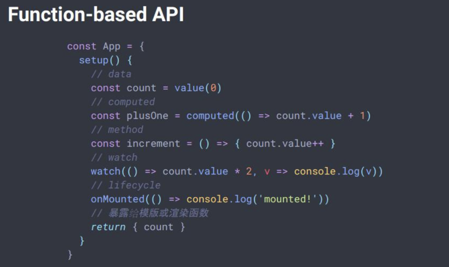

# Vue3.0新特性

[[toc]]

## Function-based API
### 在使用上
 - 更灵活的逻辑复用
 - 没有命名空间冲突
 - 数据来源清晰

### 目前Vue里逻辑组合复用的方式
 - Mixins
 - HOC
 - Renderless Component（基于scoped slots封装逻辑的组件）

缺点：
 - 数据来源不明（Mixins、HOC）
 - 命名空间冲突（Mixins）
 - 性能损耗（HOC）

### setup
调用时机：在组件实例被创建、且初始化props后

作用：`return`对象里的属性会被暴露给模板的渲染上下文

;


## Proxy
vue3.0 会用 `Proxy` 来实现响应式数据。

### 废弃`Object.defineProperty`原因
在 vue2.x，**改变数组下标** 不能来实现响应式数据的自动更新。

**实际上，`Object.defineProperty` 能监听 数组、对象。出于性价比考虑，Vue放弃了这个特性**。

原因：
 - 对数组进行数据劫持，可能会导致误触发getter、setter；
 - 需要对新增的元素手动observer。
    - 如对数组`[1, 2, 3]`进行数据劫持，调用`unshift(0)`，那只有下标为`0、1、2`的元素具有劫持效果


解决：**重写数组方法**

我们平时可以通过调用数组的`变异方法`来实现响应式，是**因为 `vue 2.x` 重写了数组方法**。

> 在Observer类里，对数据进行了判断，会将`arrayMethods`重写到原型上

当触发这些被重写的数组方法时，会触发手动observe。


### Object.defineProperty和Proxy的区别
`Object.defineProperty` 只能对属性进行劫持，需要遍历对象的每个属性。

`proxy` 是直接代理对象。

```js
const handler = {
    set (target, key, value) {
        cocnsole.log(key, 'set');
        target[key] = value;
        return true;
    }
}

const target = [];
const proxy = new Proxy(target, handler);
proxy.push(1)
```

但是`Proxy`的兼容性差，IE不支持。但后续可能会出现polyfill方案。

## 参考链接
[为什么Vue3.0使用Proxy实现数据监听？defineProperty表示不背这个锅](https://juejin.im/post/5da29a87518825094e37301c)