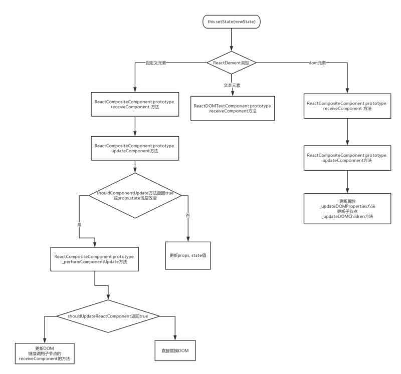

# diff算法

[[toc]]

## 传统diff算法
> 算法复杂度O(n3)

通过**递归**，对节点进行依次对比。

对于HTML DOM结构，为tree的差异查找算法。

## React的Diff算法（旧）
> 算法复杂度为O(n)

React**采用Virtual DOM来实现对真实DOM的映射**，所以React Diff算法的实质是 **对两个JavaScript对象的差异查找**。

React ddiff基于三个策略：
 - 忽略DOM节点的跨层级操作（因为特别少）
 - 拥有相同类的两个组件将会生成相似的树形结构，拥有不同类的两个组件将会生成不同的树形结构
 - 同一层级的一组子节点，通过`key`值进行区分

基于以上三个策略，React分别对`tree diff`、`component diff`、`element diff`进行了算法优化。

### tree diff
**比较范围：** 树之间。

**步骤：** 对树进行分层比较，两棵树只会对同一层次的节点进行比较。如果组件不存在了则会直接销毁。不会进一步比较。所以只需对树进行一次遍历，便能完成整个DOM树的比较。

> React只会对相同颜色方框内的DOM节点进行比较（即同一个父节点下的所有子节点）。

**建议：**
 - 应保持DOM结构的稳定（尽可能少地动态操作DOM结构）
 - 减少节点数
 - 可通过CSS隐藏/显示节点，而不是真正移除/添加DOM节点

#### 对于跨层级的节点，只有 创建 和 删除 操作

> React diff 的执行情况： delete A -> create A -> create B -> create C。

### component diff
**比较范围：** 组件之间。

**步骤：**
 - 同一类型的组件，继续比较Virtual DOM tree（按照 策略一）也可以`shouldComponentUpdate`指定无需比较
 - 如果不是，则将该组件判断为`dirty component`，从而替换整个组件（因为React认为不同类型的组件，DOM树相同的情况非常少）

> 当component D改变为component G时，即使这两个component结构相似。但React会认为**D和G是不同类型的组件**，就不会比较二者的结构：直接删除component D，重新创建component G以及其子节点。

**建议：**
 - 对于同一类型的组件，可以通过`shouldComponentUpdate()`来判断该组件是否需要diff
 - 对于类似的结构应尽量封装成组件，既减少代码量，又能减少component diff的性能损耗。

### element diff
**比较范围：** 同一层级的节点之间。

React diff提供了三种“同层级节点”的操作：`插入`、`删除`、`移动`。

**步骤：**
 - 对新集合中的节点进行循环遍历`for (name in nextChildren)`
 - 先判断 **新旧集合中是否存在相同的节点**（通过唯一的`key`值）`if(prevChild === nextChild)`，如果不存在，则进行 `插入`；
 - 如果旧集合中存在，则比较 `当前节点在旧集合中的位置（child._mountIndex）` 与 `访问过的节点，在旧集合中最右的位置（lastInddex）`
 - `if(child._mountIndex > lastIndex)`，说明**当前访问节点在旧集合中的位置就比上一个节点位置靠后，则该节点不会影响其他节点的位置，不需执行移动操作**；否则进行移动

> React diff 的执行情况：B、D不作任何操作，A、C进行移动即可。

**建议：**
 - 给同一层级的同组子节点设置`key`值
 - 尽量减少类似将最后一个节点移动到列表首部的操作

### React更新阶段
实际上，只有在 **React更新阶段的DOM元素更新过程** 才会执行Diff算法。

React更新阶段会对ReactElement类型（Text节点、组件、DOM）判断，从而进行不同的操作。
 - Text节点：直接更新文案
 - 组件：结合策略二
 - DOM：**调用diff算法**（`this._updateDOMChildren`）

### 总结
)

## React的Diff算法（新）
React16 的diff策略采用 **从链表头部开始比较** 的算法，属于 **层次遍历**。算法是建立在 **一个节点的插入、删除、移动等操作都是在节点树的同一层级中** 进行的。

对于Diff，新老节点的对比，是以新节点为标准，然后构建整个`currentInWorkProgress`。

对于新的 children 会有**4种情况**：
 - TextNode
 - 单个React Element（通过该节点是否有 `$$typeof` 区分）
 - 数组
 - 可迭代的children，跟数组的处理方式差不多

### Diff TextNode
Diff TextNode主要是判断：**currentFirstNode是否为TextNode**。
> currentFirstNode是当前该层的第一个节点。

#### currentFirstNode是TextNoded

思路：先找有没有可以复用的节点，如果没有就另外创建一个。

### Diff React Element
判断这个节点是否可以复用：
 - key相同
 - 节点的类型相同

同时满足以上两点，代表这个节点只是内容变化，不需要创建新的节点，是可以复用的。

如果节点类型不相同，就将节点从当前节点开始，把剩余的都删除。

### Diff Array

建议：在开发组件时，保持稳定的DOM结构有助于性能提升。

## 参考链接
 - [React 源码剖析系列 － 不可思议的 react diff](https://zhuanlan.zhihu.com/p/20346379)
 - [谈谈React中Diff算法的策略及实现](https://cloud.tencent.com/developer/article/1402610)