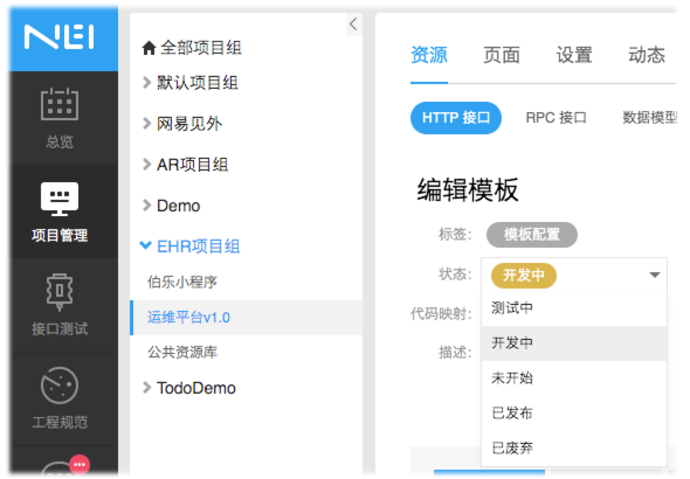

:::warning
前言：本规范的应用范围为EHR的新项目（从2020年Q1起）；大部分老项目的接口也将计划在Q3前逐步迁移至NEI，可先酌情参考。

当规范约定先行时，可避免开发过程中产生不必要的问题，从而提高开发效率。
:::

大致流程：


[[toc]]

## ① 基本要求
| 基本要求 | 说明 | 备注 |
| ----- |:---:|:---:|
| 时间 | 在后端完成 **开发方案评审** 后 | |
| 接口平台 | [NEI](https://nei.netease.com/project?pid=51981) | [GoTest](https://gotest.hz.netease.com/web/#/home/project/api?projectId=175)仅作接口测试使用 |
| 约定内容 | 接口的基本属性、请求/响应信息 | 后端主导，前端填写 |

### “约定内容”详细说明
#### 接口的基本属性
| 接口字段 | 说明 | 示例 |
| ----- |:---:|:---:|
| 接口名称 | 必填。动词 + 名词 | 新增词库|
| 请求方式、URL | 必填。符合RESTful风格（见下文） | POST /search/words |
| 业务分组 | 必填。功能大模块 | 搜索管理 |
| 标签 | 必填。功能小模块 | 词库配置 |
| 负责人 | 必填。一般填“前端人员” | 贺世宇 |
| 关注人 | 必填。一般填“后端人员” | 张少军 |


#### 接口的请求/响应信息
| 接口字段 | 说明 | 说明 |
| ----- |:---:|:---:|
| 请求头 | 选填。只列出自定义请求头 | / |
| 字段名称 | 必填。与后端表中字段统一 | 可临时定义，后续修正 |
| 字段类型 | 必填 | / |
| 字段描述 | 必填。大致描述、空值、枚举值 | 尽可能详细，可避免后期重复沟通 |
| 是否必需 | 必填 | / |
| 生成规则 | 选填 | 自定义Mock数据生成 |


## ② RESTful API规范


## ③ [前端] 接口Mock
在之后的新项目开发中，前端可直接通过NEI生成Mock数据，无需专门维护，更加方便快捷！

[《NEI基本使用说明》by heshiyu](http://doc.hz.netease.com/pages/viewpage.action?pageId=235675485)

> *如果想了解更多NEI相关知识，可点击：*[《NEI详细教程》](https://github.com/x-orpheus/nei-toolkit/blob/master/doc/%E4%BD%BF%E7%94%A8NEI%E8%BF%9B%E8%A1%8C%E5%89%8D%E5%90%8E%E7%AB%AF%E5%B9%B6%E8%A1%8C%E5%BC%80%E5%8F%91.md)

三条准则：
 - `接口状态`。前端们应该养成好习惯，及时更新接口状态，减少重复问题的沟通
    
    

 - `导入GoTest`。主开发应该在版本提测前导入，方便QA进行接口测试
    )

 - `及时更新`。前端们应负责保持NEI上的接口处于最新状态。
    > 若已提测，则需将该接口重新导入GoTest。


## ④ [后端] 接口自测
三条准则：
 - `Controller层面`无明显错误
    - 例如请求方式正确，参数类型正确，返回字段齐全以及类型正确

 - `Servic层面`跑通基本功能（例如：增删改查）
    - 增删改查内部遇到复杂逻辑按实际情况自测;

 - `数据库`
    - 校对默认值和字数限制微增大;

## ⑤ 接口联调
### 联调方式
| 联调方式 | 前端 | 后端 | 部署 |
| ----- |:---:|:---:|:---:|
| 1、部署联调 | 服务器 | 服务器 | 至少每天一次 |
| 2、本地联调 | 本地 | 服务器 | / |

不推荐采用`2、本地联调`，原因：
 - 联调应当在 **前、后端确保各自的开发质量后** 进行
 - 本地环境的不稳定性
 - 部分特殊情景无法模拟

## ⑥ 接口测试
### 测试策略
接口测试策略共分为3大方面：**测试分析、测试分类、测试工具**。


## ⑦ 附录
### 状态码
#### 常用状态码
```js
// 状态码枚举
export const ServerCode = {
    SUCCESS: 200,
    CONTINUE: 400,
    WRONG_PARAM: 401,
    WRONG_REQUEST: 402,
    FORBIDDEN: 403,
    WRONG_URL: 404,
    NO_LOGIN: 406,
    TIME_OUT: 408,
    WRONG_SERVER: 500,
    WRONG_REALIZE: 501,
    WRONG_GATEWAY: 502,
    BAD_SERVER: 503,
    GATEWAY_TIME_OUT: 504,
    WRONG_VERSION: 505
};

// 状态码描述枚举
export const ServerCodeMap = {
    [ServerCode.SUCCESS]: '成功',
    [ServerCode.CONTINUE]: '继续', // 传递指定“继续参数”即可成功
    [ServerCode.WRONG_PARAM]: '参数格式出错',
    [ServerCode.WRONG_REQUEST]: '请求出错',
    [ServerCode.FORBIDDEN]: '拒绝访问',
    [ServerCode.WRONG_URL]: '请求地址出错',
    [ServerCode.NO_LOGIN]: '未登录',
    [ServerCode.TIME_OUT]: '请求超时',
    [ServerCode.WRONG_SERVER]: '服务器内部错误',
    [ServerCode.WRONG_REALIZE]: '服务未实现',
    [ServerCode.WRONG_GATEWAY]: '网关错误',
    [ServerCode.BAD_SERVER]: '服务不可用',
    [ServerCode.GATEWAY_TIME_OUT]: '网关超时',
    [ServerCode.WRONG_VERSION]: 'HTTP版本不受支持'
};

// 重定向状态码
export const RedirectMap = {
    [ServerCode.FORBIDDEN]: '#/403',
    [ServerCode.NO_LOGIN]: '#/login'
};
```

#### 注意事项
目前前端有2种提示形式：
 - `400`，可扩展至`400101`、`400102`等来表示业务上更多种可能的情况
 - `402`，一般需后端提供`msg`字段

