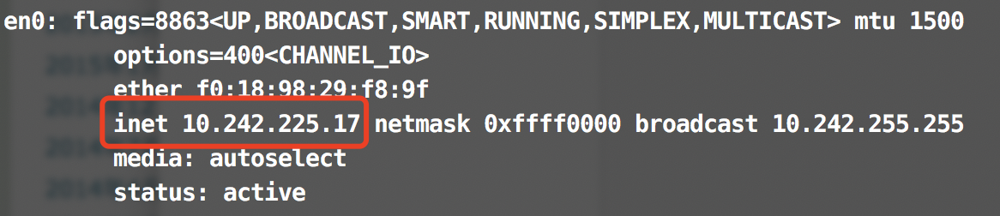
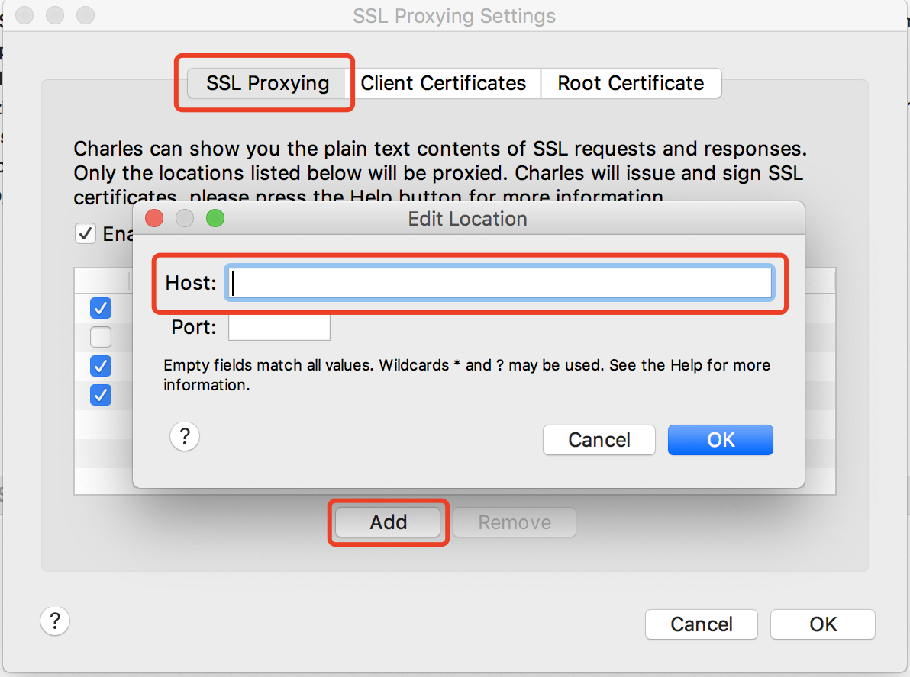

# 利用charles调试

[[toc]]

## 安装
[Charles官网下载](https://www.charlesproxy.com/download/)

## 抓真机请求
 - 电脑和手机连在同一个Wifi下
 - `手机设置` > `Wi-Fi` > `当前Wifi下的高级配置` >` HTTP代理/配置代理` > `手动` > `输入服务器、端口`
> 其中 “服务器” 为当前Wifi的ip。
> 
> MAC可通过 CMD > ifconfig > en0 > inet
>
> 
> 
> “端口”，可通过`Charles` > `Proxy` > `Proxy Settings` > `HTTP Proxy` > `Port` 查看。

## 抓HTTPS包
打开Charles，点击`Proxy` > `SSL Proxying Settings`，输入要抓的HTTPS域名（如：`www.dbxyyxt.com`）即可

