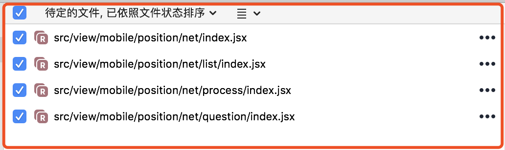

# [shell脚本] 遍历目录批量修改文件名

[[toc]]

在工作中，打算把项目的构建搬到线上服务器（NDP）自动进行。但由于构建服务器上的Node.js为Linux版本，会导致 **原本在本地开发时使用非Linux版本的Node.js开发过程中不存在文件路径的大小写敏感问题** 得以暴露。
> 即：在大小写敏感的服务器上对于命名为Index.jsx的组件，在给类似 `import Header from '@/components/header'` 的导入语句自动拼接的 `/index.jsx` 后无法找到。

**建议：一律使用 小写、短横线 来命名文件/文件夹。**

对于老项目中的 `Index.jsx` 文件需进行修改时，可以使用以下 shell 脚本：

## 新建脚本
在项目根目录下，新建如下脚本，可命名为：**change-name.sh**
> 也可直接下载：[change-name.sh](/change-name.sh)


```bash
#!/bin/bash
declare -i count=0 #文件修改数

function changeName(){
	new=`echo $1|sed 's/I/i/g'`
	git mv $1 $new

	count=$count+1
}

function travFolder(){
	if [ "$1"x != ""x ];then
		flist=`ls $1`

		cd $1

		for f in $flist
		do
			if test -d $f
			then
				travFolder $f
			else
				if [ "$f"x = "Index.jsx"x ];then
					echo `pwd`"/$f"
					changeName $f
				fi
			fi
		done
		cd ../
	else
		echo 请在第二个参数传入要开始遍历的目录（推荐以 相对路径 的形式）
	fi
}

travFolder $1

echo - 批量修改了 $count 个文件 -
```

## 调用脚本
```shell
sh change-name.sh /path/to/source/dir
# /path/to/source/dir为开始遍历的目录地址，建议相对路径
```

## 效果
终端输出：


这些改名操作**最终也能被Git识别**到：

